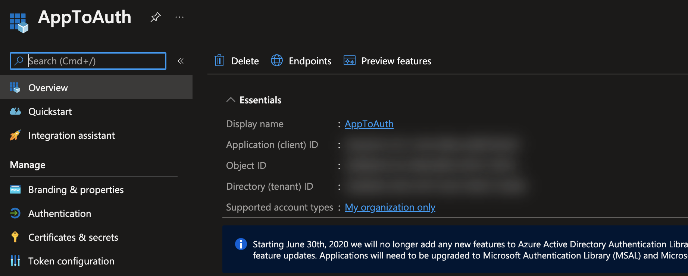
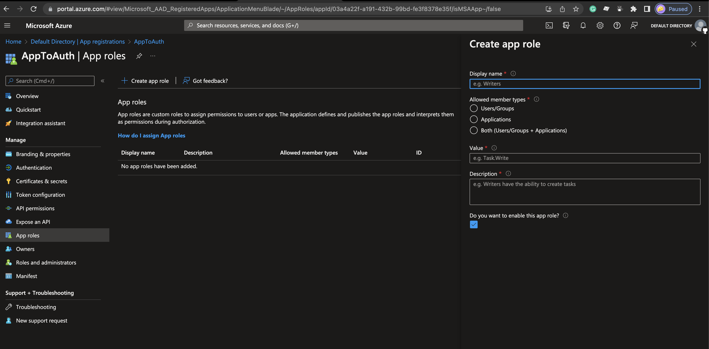
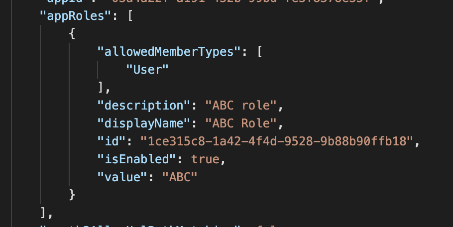

## Kickoff

This will be a brief blog post to show how to setup RBAC with a new .Net API. You can also follow a lot of these steps to make an application have RBAC if you need to invest into it in a legacy app.

## Setup

If you are creating a new app from scratch you can create it with auth to start that can be

```bash
dotnet new mvc -au SingleOrg
```

that will create a new API app single org auth ready to be configured.

Now you need to go to portal.azure.com to get all of your config variables. You are going to want to go to Azure Active Directory => App Registrations => Create New. Now you have all of the config vars you need there. There are two ways you can create a role. The first way is if you have the preview features on or this is far enough in the future there is a GUI for it like this.  You can also edit the manifest directly and add something like the following  Now that you have roles you can consume them on your API.

## API Config
