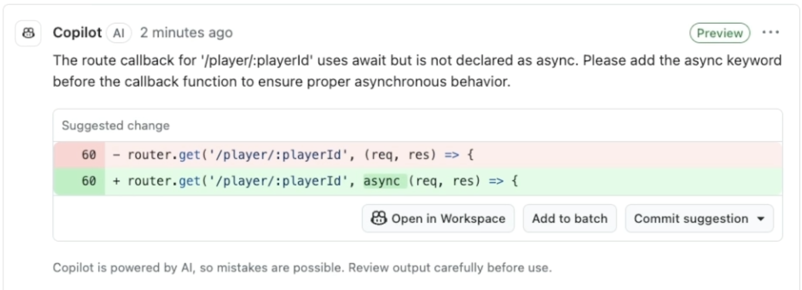

# GitHub Copilot Code Review is Now Generally Available!

In a major win for developers everywhere, GitHub Copilot Code Review has moved out of public preview and is now generally available. In just over a month since the public preview launch, over 1 million developers have already tried Copilot Code Review, demonstrating its potential to streamline the code review process.

## What is Copilot Code Review?

Code review is one of the most critical parts of software development, but manual reviews can be time-consuming and sometimes tedious. Copilot Code Review steps in to offload the basics—spotting bugs, identifying potential performance issues, and even suggesting fixes. This means you can start iterating on your code immediately, keeping your repositories clean, maintainable, and high quality.

## Why I Love This Tool

I've been experimenting with Copilot Code Review for a while now, and the experience has been incredibly refreshing. Here are a few reasons why I'm a fan:

### VS Code Suggestions Are Super Cool!
The real-time suggestions that appear in Visual Studio Code are not only insightful but also a blast to work with. They seamlessly integrate into my workflow and provide just the right nudge to improve my code quality.  

### Requesting a Code Review is as Natural as Talking to a Colleague
One of the most impressive features is how you can ask for a code review just like you would ask a person. Whether you set up automatic reviews through repository rules or trigger a review on-demand, the process feels conversational and intuitive.  

### Pull Request (PR) Suggestions at a Glance
Seeing PR suggestions right inside GitHub is a game changer. It makes the code review process more interactive and visual, which means fewer context switches and more focus on writing great code.  

## Productivity Gains and Cost Savings

One of the best parts of this update is that Copilot Code Review is available to all paid Copilot subscribers. This means there's no longer a need to shell out extra cash for third-party code review tools. For me, that translates into:
- **Increased Productivity:** Faster iterations on code while waiting for human reviews.
- **Cost Savings:** One subscription covers multiple essential tools.
- **Streamlined Workflow:** Everything you need is integrated into GitHub and VS Code, reducing the hassle of juggling multiple tools.

## What’s Next?

The journey doesn't stop here. With the recent support for C, C++, Kotlin, and Swift in public preview—and upcoming support for HTML and txt—the future of Copilot Code Review is bright. GitHub is clearly committed to continuously enhancing this tool, and I can’t wait to see what’s in store.

## Final Thoughts

GitHub Copilot Code Review is redefining how we approach code reviews. Its intuitive suggestions, interactive features, and built-in cost efficiencies are making coding smoother and more enjoyable. Whether you're working solo or as part of a large team, this tool is a significant step forward in maintaining high-quality code with less effort.

Have you had a chance to try out Copilot Code Review yet? Let me know your thoughts and experiences!
