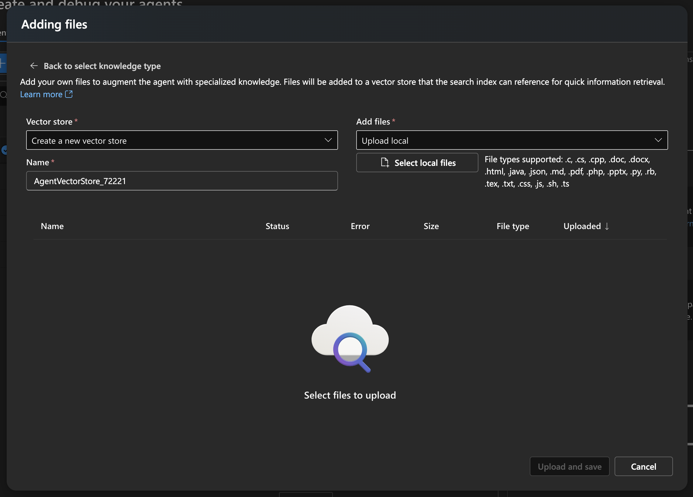

# Azure Autonomous Agents In Public Preview! 

If you want to read more from Microsoft's announcement of Autonomous Agents you can read that [here.](https://techcommunity.microsoft.com/blog/azure-ai-services-blog/unlocking-ai-powered-automation-with-azure-ai-agent-service/4372041)For this blog post I am going to walk you through the UI and how to make our first custom agent!

## Getting Started
We first are going to need an Azure AI Foundry resource and AI Project. Once we do that we are going to create an agent. All agents we create end up in the agent view like this!

In this view we can now configure some additional tools for our agents to use! 

The first option is adding knowledge. We can a few different sources like a file, Azure AI index, and some models allow for Bing Search for grounding data! 

The file section supports quite a few file types! 

We can also use code interpreter to programmatically do things!

> Use code interpreter to read and interpret information from datasets, generate code, and create graphs and charts using your data
It supports a wide range of files!

## Start Testing Out Agents
Once we have our agent fully configured we can start testing out our agent!

Now we can start testing out our agent!

We can continue to see how our agent is doing by looking at the chat history! Once we are satisfied with our agent we can save it and start using it in our applications!

## Conclusion
We have now covered the most recent announcement of Azure AI Agents! We have covered the UI and how to make our first custom agent! If you want to learn more make sure you review the announcement from Microsoft [here.](https://techcommunity.microsoft.com/blog/azure-ai-services-blog/unlocking-ai-powered-automation-with-azure-ai-agent-service/4372041)