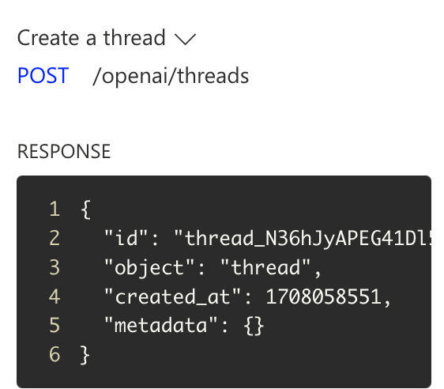

# New Feature Alert: Azure AI Assistants

## What are assistants?
Assistants are a new feature in Azure OpenAI Service that are designed to make it easy for developers to build their own copilot experience into their apps!

Assistants are purpose-built AIs that can allow you to connect to your data, automate tasks, have infinity long threads, which allows developers to not have to developer around the model's context window size limitations. Assistance can use quite a few different things like access files in several formats, use different tools like code interpreter, call external functions, and other new features that will be coming soon! Being under the Azure Open AI service your data, like always, remains your own and won't be used outside of your subreption or used to train the models. For the time being these are in preview, but are only available in US-East 2, Australia East, and Sweden Central. 

## What does it look like using these?
Just a quick reminder this is in public preview. So while this is the current state it doesn't mean this is the final state. Let's start with things right out of the box! 

We can see this looks fairly similar to the chat option. However, unlike the single template you have for chat, we can have multiple assistants. This allows you to have different assistants for different tasks. We can add functions which are essentially APIs. This allows your assistant to call APIs either within your organization or outside of your walls if you want to enable it to get more up to date information. This means even if your model is only as current as it was trained, you can augment it with APIs to get the most up to date information.

The first section is our instructions. That is similar to the template section we have for chat. Nothing much is different from there other than we can easily save and open each assistant! 

You can see the first assistant I created. 

After that is creating a function. This is where you can add your APIs. By default, you have two example APIs to hit. One is the weather api and one is a stock api. Here is an example format of a function. 

I also created a few duplicates to see if I could quickly hit a limit but we can support connecting to at least 4 different APIs.

After that we can have code interpreter on or off. It is a toggle.

The final feature on the left hand side is files. If you have less than 20 files you can potentially get file search on your models without an Azure AI Search instance. This could save you quite a bit of money! 

You can also see the vast amount of file formats that are supported. We can also see the max files today is 20. 

## Using AI
Now we can actually use the AI so in this example I have a very basic assistant setup and the weather API wired up. I asked it what the weather. It asked me the format I'd like the response back in.

I put the format I wanted it back in and hit go. Then, I got back the weather in Seattle! 

Every time we make calls or configure things, we can see the logs on the right.

This shows us the URIs that are being called and the api responses we are getting back.

We are able to use the URIs to call if we want to use the APIs outside of the assistant.

## Wrap Up
I think assistants are very powerful especially being able to fine tune profiles to alter personas to get the best information back for different users. I am excited to see what other features come out, and how easy it will truly get to integrate with Azure Open AI.