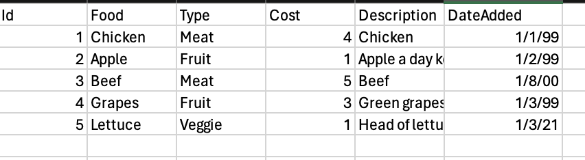
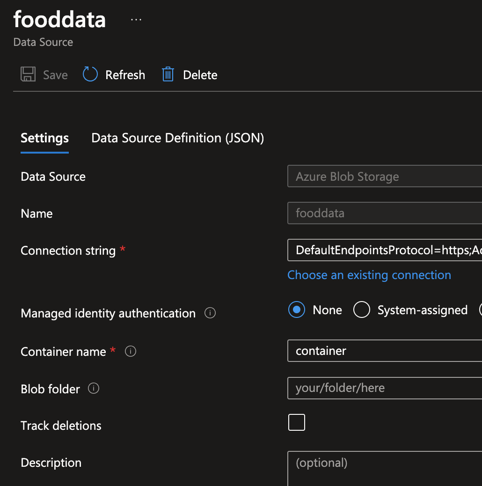
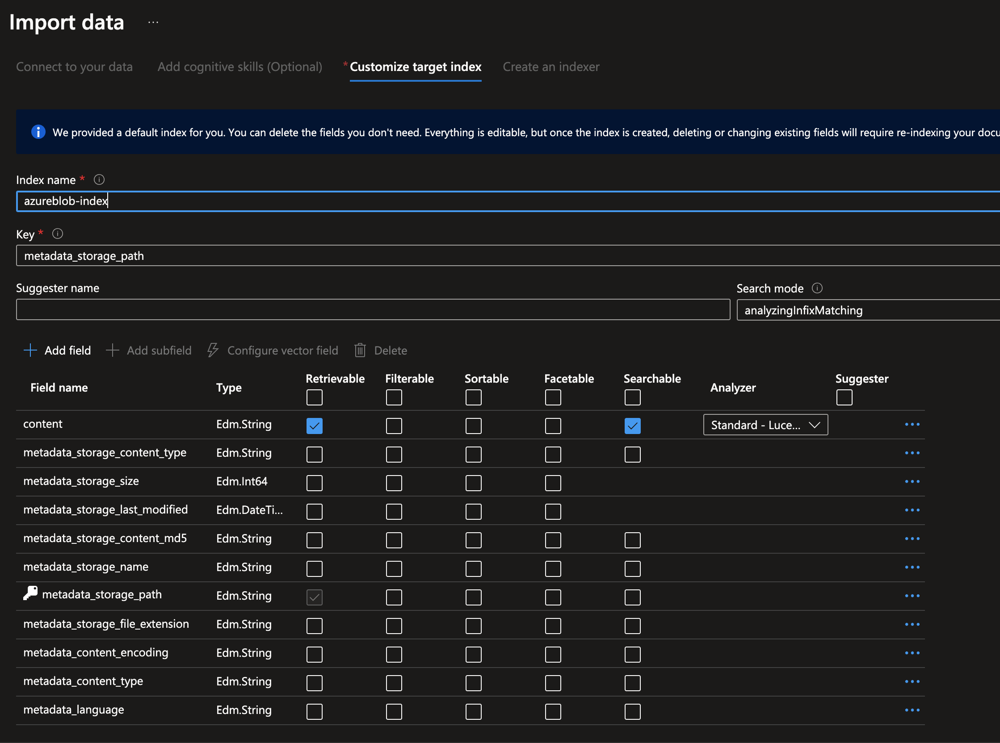
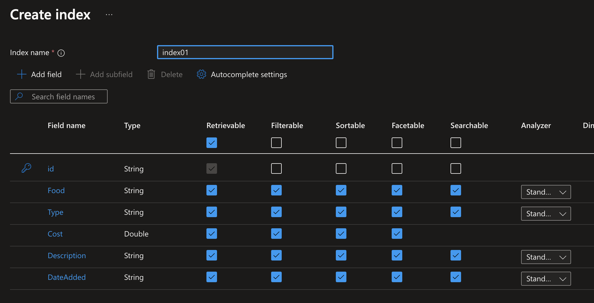
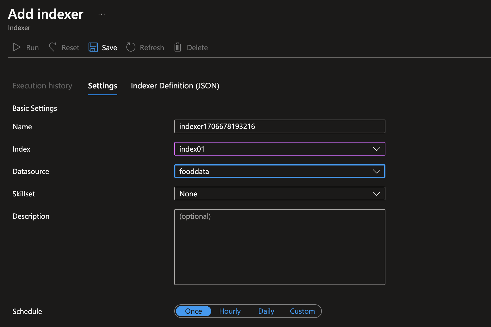
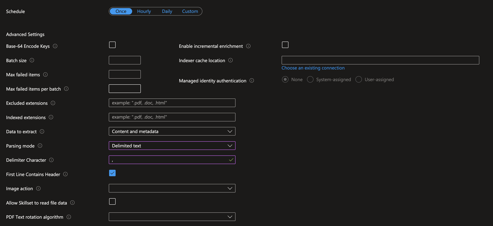
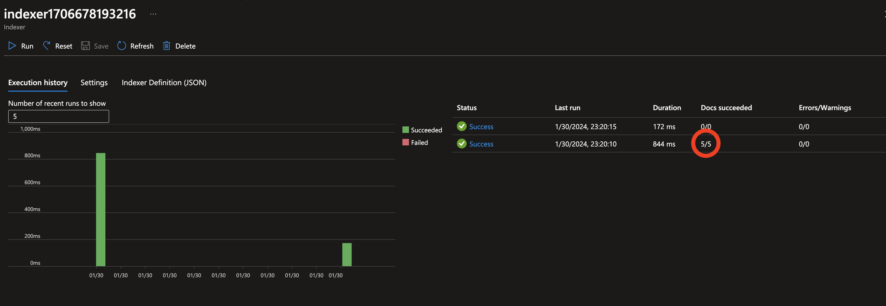
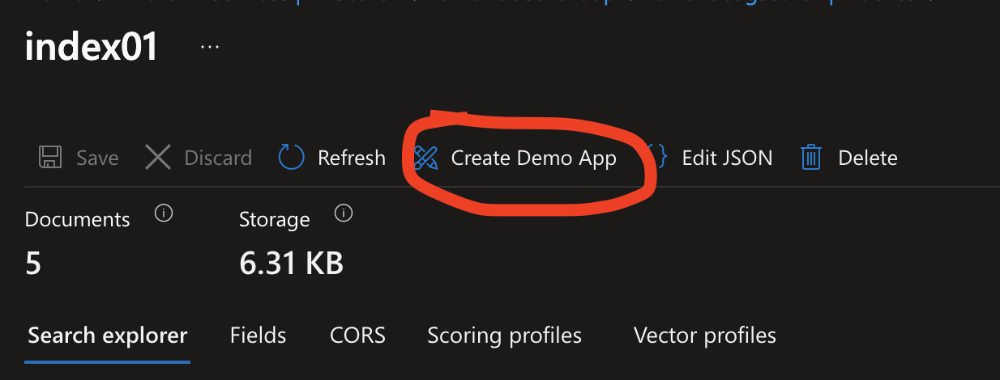

# Problem Statement
We have some structured data, but without a lot of manual work we can't really use it to answer questions. We would like to be able to easily find things and answer any question!

## Requirements To Begin
1. Azure Subscription

2. Azure Open AI Services

3. Azure Pay As You Go Account

4. Azure AI Search

## Azure AI Search
We are going to use Azure AI Search. To start we are going to try to index our simple data structure in our CSV. It looks like this if you would like to follow the example! 

We are going to assume your data is already in an Azure storage account. There are quite a few walkthroughs on that so I'm going to skip that part. We are going to now setup our data source like so! 

Now, you will probably want to click on import data on Azure Search however that will be a problem.
### Creating the Index

What you will see is everything is within content. This structure works well if you are going to have many files that aren't super deep that we want to search. This doesn't work well if we want 1 file and want to search it. We are going to have to use a different method to index our data. We are going to use the Azure Search Indexer that we create manually. Let's click on index on the side and create a new index like the following.

### Creating Indexer
Now that we have our index matching our data structure we can use all of the fields and map to it. Each field we set allows for a different thing to happen. We can retrieve the data, filter it, sort it, search it, and more. Now we are going to need to use an indexer to run against our data source. We are going to configure it with the index we just setup and our data source! 

For the bottom section the part we need to focus on is make sure you put that it is a delimited list and we are using ',' as our delimiter. Since CSV stands for comma separated values.

We want to also make sure we tick the box to indicate we have titles in our first row. Now we can run our indexer and we should see our data indexed!

### Running Indexer
Now that we have saved it, it should auto kick off an index. You can also hit run if you want to make sure and we should see something like this! 

We can see we ran our indexer twice. It did find our 5 rows that were in our CSV, and it tried to run again and found no real changes. Now we can use our index to search our data!

### Querying Data
There are two ways to test our data. We can go to the search explorer and use the query syntax to test our data. We can also go to the index directly and notice a button that says "Create Demo App"

When we hit that button it will download an HTML app that hits our search index. We now can play with our data in a demo app. We can sort the data, filter it, and just see what sort of data we get back.

## Conclusion
Now that we have the ability to search a CSV and query the data this allows us to start building out a robust search. We can continue on this using this index to connect to an Azure Open AI instance if we would like to have an AI answer questions about our data. Maybe that would be a great part 2 to this blog post!
