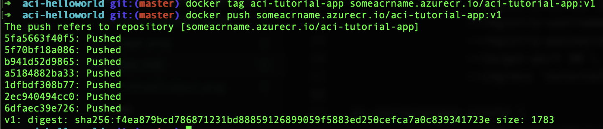
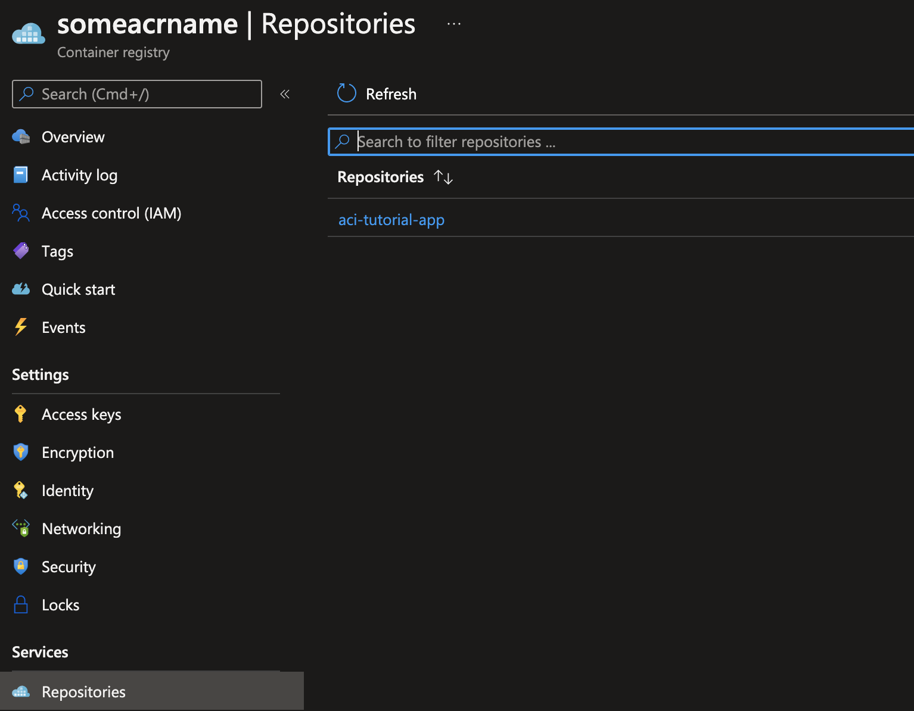
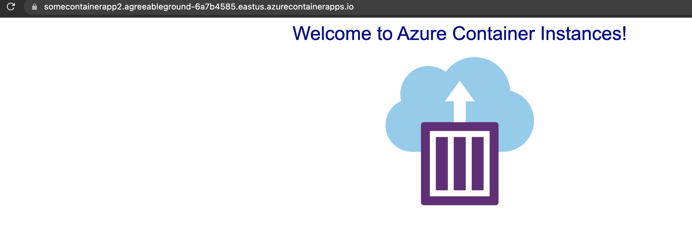

## Why do I want container Apps?

Have you ever used Azure container instances and thought, man these are super cheap but I wish I didn't have to nuke the whole thing just to deploy a new node, change env variables, or be able to scale? Have you ever looked at orchestrating K8s and thought that looks like too much, I like all of the features but that's a lot of admin work? Well now you can with Azure container apps!

## Preparation

To begin this tutorial we are going to start with the [tutorial here.](https://docs.microsoft.com/en-us/azure/container-instances/container-instances-tutorial-prepare-app) I am going to change a few things slightly to fully explain everything a little deeper. You can find the code [here.](https://github.com/Azure-Samples/aci-helloworld)Let's start by cloning it and making sure you have docker desktop installed. You can google it or find it here for [installation](https://www.docker.com/products/docker-desktop/). Once you have that installed we will start by creating your container locally!

## Create container images

The first step the tutorial walks you through is running docker build. Docker build is a way to compile your docker file with your code into an image. Their command also tags your app `docker build . -t aci-tutorial-app`. The next command to run is to run the image in a detached state (-d so it doesn't hold your terminal hostage), giving it a port (-p exposing a port in your container and mapping one to it), and specifying the image.

`docker run -d -p 8080:80 aci-tutorial-app`

## Creating the container registry

The next step of the walk through wants you to login to you azure `az login` through the azure CLI. That will log you into Azure. After that you need to run something like `az group create --name myResourceGroup --location eastus` this will create a resource group that we are going to use to to house our container registry and container apps. After that you need to run `az acr create --resource-group myResourceGroup --name someacrname --sku Basic` after your ACR (Azure Container Registry) is created you need `az acr login --name someacrname` (make sure your docker damon is running when you do it). After we need to get our ACR login server to run this command (this will be used to tag our images) `az acr list --resource-group myResourceGroup --query "[].{acrLoginServer:loginServer}" --output table`. You can also guess what your login server name is it's usually your acr's name + .azurecr.io in this example ours would be someacrname.azurecr.io and we need that for the next step. Next you want to actually tag your local images to deploy them that will look like this `docker tag aci-tutorial-app someacrname.azurecr.io/aci-tutorial-app:v1`. Now that our image is tagged we can push it up to our repository `docker push someacrname.azurecr.io/aci-tutorial-app:v1` you should see something like this!  Once that succeeds you should be able to see your first docker image in your ACR  You can also view the output via the cli to see your first image `az acr repository list --name someacrname --output table`

## Standing Up a container app

At this point you should have an ACR and an image in that registry. Now it's time to create our first container app to use this image! First thing we need is a container app environment

```
az containerapp env create \
  --name someenv \
  --resource-group someresourcegroup \
  --location eastus
```

it will ask you to install a few extensions and you can say yes for those.

Finally it's time to deploy our first container app! You will first want to save off the access token for pulling images like
`az acr update -n someacrname --admin-enabled true`

```
az containerapp create \
                --name somecontainerapp \
                --resource-group myResourceGroup \
                --environment someenv \
                --image someacrname.azurecr.io/aci-tutorial-app:v1 \
                --registry-server someacrname.azurecr.io \
                --registry-username someacrname \
                --registry-password <GET YOUR PW> \
                --target-port 80 \
                --ingress 'external'
```

The big reveal 

Now this will get your image onto a container app. Have fun getting the benefits of K8s without the overhead.
