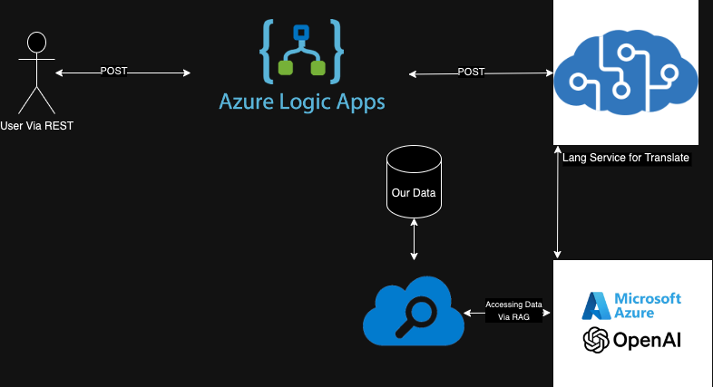
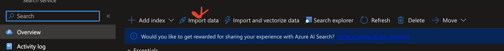
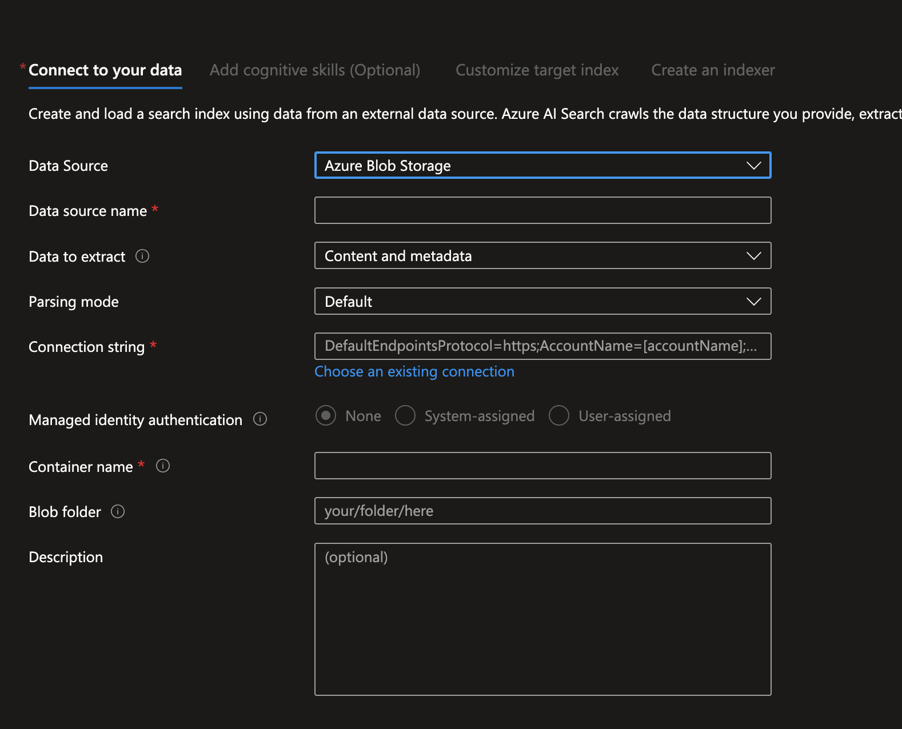
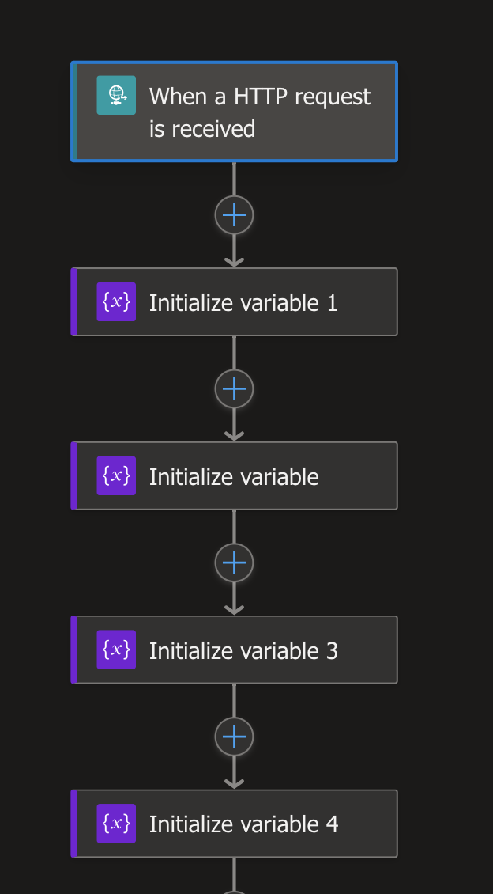
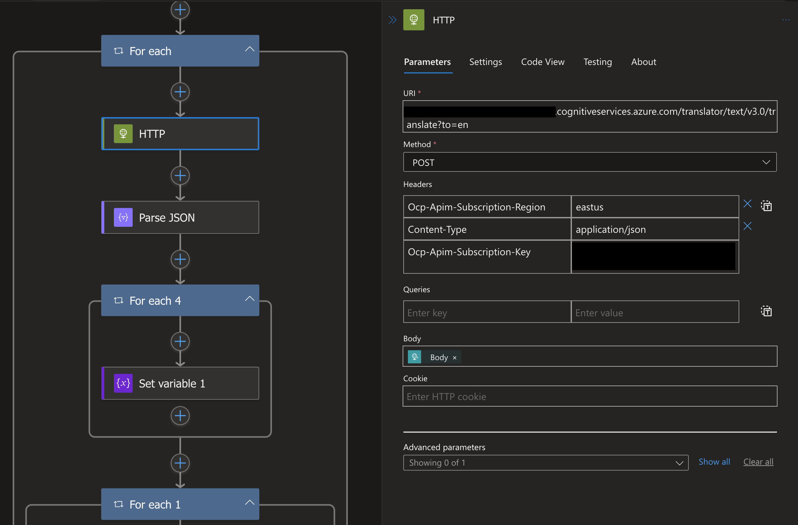
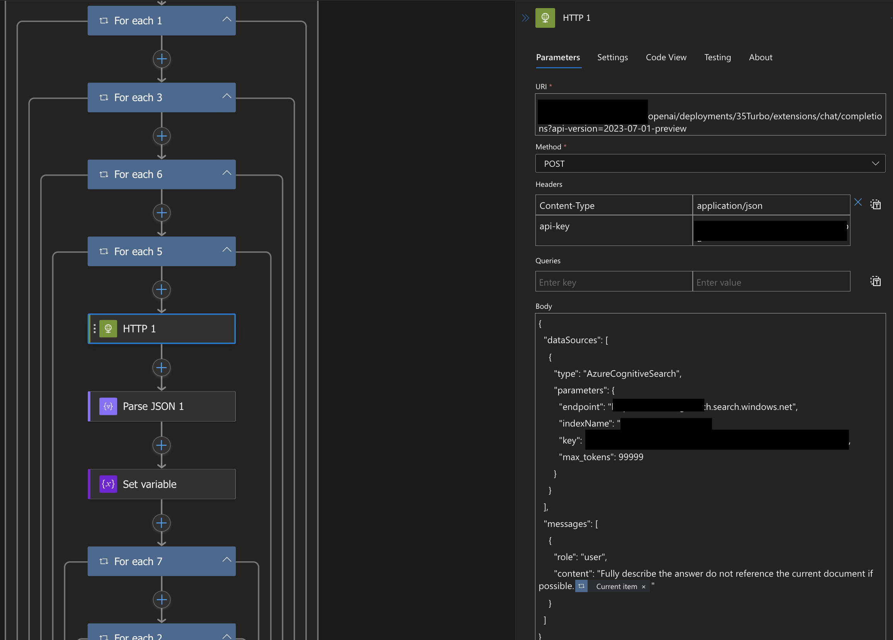
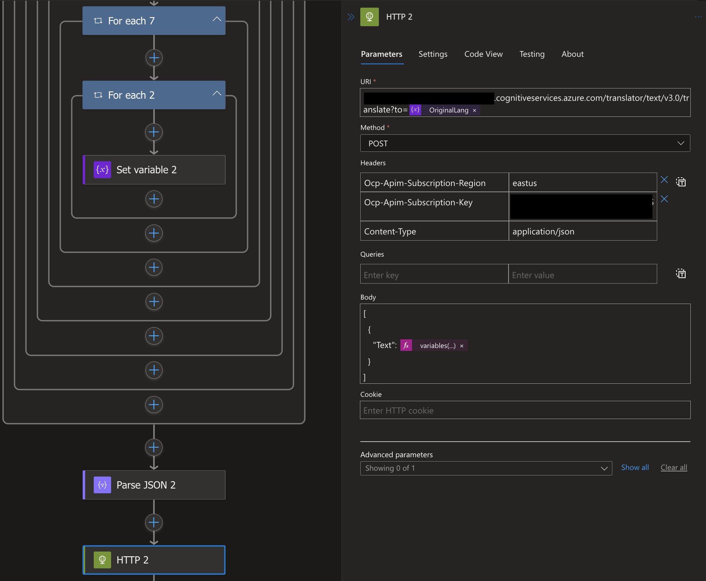
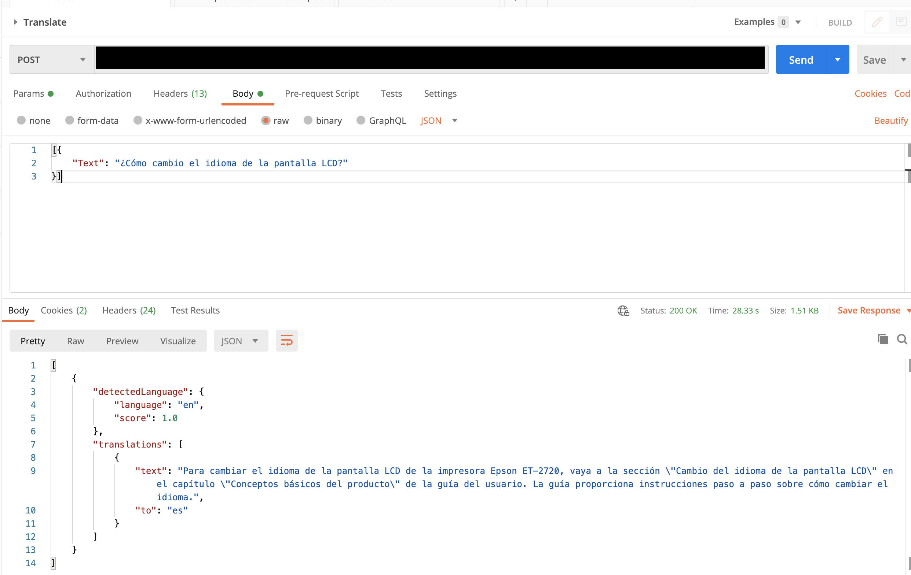

# Problem Statement
Now that companies are continuing to grow globally, the need for multilingual support is becoming more and more important. However, it is not always feasible to have a support team that can speak every language. This is where Azure Cognitive Services and Azure Logic Apps can help. We are going to use the RAG pattern with Azure Open AI to build a universal translator bot that can translate between any language and use only a single English document to answer any question in any language.

## Requirements To Begin
AZURE SUBSCRIPTION
1. Azure Open AI Services

2. Azure Pay As You Go Account

Our architecture diagram demonstrates shows how we are planning to use different Azure services to build our universal translator bot. We will be using Azure Logic Apps to trigger our bot, Azure Cognitive Services to translate our text and Azure Open AI in tandem with Azure Cognitive Search to Answer our question. Once that occurs everything will go back just in reverse to our user.

## Setting Up Azure Search
We are going to need to setup Azure search in order to have RAG work. We are going to use Azure Cognitive Search to index our document so we can reference it in Azure Open AI's data source parameter. In this example we are going to have our data stored in a storage account, but you can store it in quite a few places. We are going to click import data and go through the steps. This wizard will also build us a good starting index. If you are not great at building search indexes like me, this will probably be good enough until you learn where you need to optimize it.

Once you index is done you are ready to go to the next step of creating the logic app!

## Creating the Logic App

To start off we need to create our logic app that we will use Postman to trigger. We are going to start with a blank logic app and then add our steps in. We are going to start with a trigger that will be a Post request. This will be the ingress to our logic app. We will then add a step to translate our text. We will then add a step to use Azure Open AI to answer our question. We will add a step to translate the answer back to the original language. Finally, we will add a step to send the answer back to the user.

To start off on the logic app I am setting the trigger which is an HTTP post and initializing a few variables I'm going to use to hold state. 

Quick note you will you will start to see a lot of for each loops and those are all for cycling through the data structures that are returned from the services we are using. There is probably a cleaner way to do this, but this is what I came up with. 

Next, we are going to add a step to translate our text. We are going to use the Azure Cognitive Services Translator Text API to do this. We are going to use the translate text action and we are going to use the text we got from our trigger and translate it to English. We are going to use the variable we created earlier to hold the state of the translated text and the language the text came from.

 

This api will return a JSON object that will hold our answer as well as the language it started with. We are going to use the language it started with to translate the answer back to the original language later on so we are saving that for later. Next we are going to use Open AI to answer our question. We are going to use the Open AI answer action and we are going to use the translated text we got from the previous step. We are going to use the variable we created earlier to hold the state of the answer.

This will return some more data using our saved printer manual that is indexed by Azure Search Index. We are going to use the answer to continue on to the next step which will be to translate it back to the original language we got.

Now the answer is back into the original language and we can send it back to the user. Here is an example of what that looks like in PostMan!

## Conclusion
Now you should be able to build a universal translator using low code! You could also attempt to do this yourself as a much simpler logic app if you do this whole logic app just in one API call to Open AI. If this gets enough interest I will do a follow up post on how to do that. One hint I will give you is use system messages to layout the tasks of translating to English and back to the original language. Thanks for reading!