## Background
In the early 2000s early 2010s the world was a strange place. Mobile phones were reaching so many people in so many parts of the US and texting was quickly becoming the way people communicated. Lol, OMG, BRB, etc were all being engrained in the lexicon of the world. Now that mobile networks were speeding up and texting were becoming more common, unlimited texting quickly started to become common state. This is still around the time the first iPhone came out and smart phones weren't nearly as main stream as they are today. That means web browsing was super expensive on mobile devices if you could even get it. In that emerging market came [ChaCha](https://en.wikipedia.org/wiki/ChaCha_(search_engine)). ChaCha was a search engine that you could text via SMS and get a response back to your questions. "Users were able to send an SMS message with their question to 242–242, where Guides would then answer it. Standard messaging fees could apply, but ChaCha never charged additional fees." Now instead of guides and droves of free lancers we will instead have AI powering our questions.

## Requirements To Begin

### Azure Subscription
1. Azure Open AI Services 
1. Azure Pay As you go Account
Note there is a way to use azure communication services to do this if you want to be completely in, however this will cost you a couple dollars a month to get an SMS number.

### Twilio Account
This is what we are going to use and a trial account for two way SMS communications.

## Architecture

Our architecture diagram is showing our user is going to send a question via SMS to our number. That number will then trigger a post request to an Azure logic app, which once in Azure will pass our request along to our Azure Open AI Service. 

## Setting up the solution

#### Twilio Part 1
To start off we need to sign up for a free Twilio account if you don't have one already. We want to make sure we get a phone number and make sure it is active for 2 way SMS. Then once you have your number we want we need to got to Azure to setup up Open AI and our logic app.

#### Azure
Just in case you don't have access to Azure Open AI you can request access for it [here.](https://learn.microsoft.com/en-us/azure/cognitive-services/openai/overview?WT.mc_id=AZ-MVP-5005115#how-do-i-get-access-to-azure-openai) As of right now it is GA (general availability), but you do have to request access to it. Assuming you have access the first thing we want to do is to create an Azure OpenAI service. This will create a service and we want to go into Azure OpenAI Studio. Then, we want to make sure we deploy a new model. You can either deploy text-davinci-003 as a good general model for questions. 
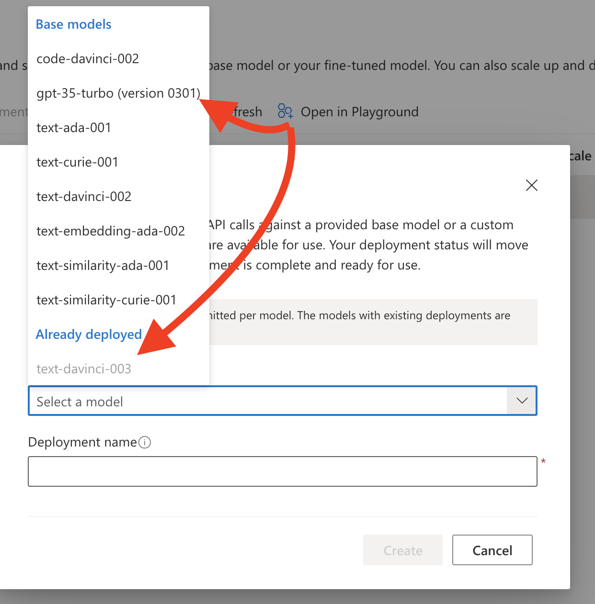
You can also deploy the code one if you are going to ask more code questions, but via SMS that might be hard to read. You could also use turbo for faster responses, but it will cost a bit more and I haven't seen latency as an issue.

Now that your model is deployed you can play with your model. You can go to the GPT play ground and play with questions, lengths of responses, how much you want it to think, the amount of responses, how close it is, how much liberty it takes, etc. Here are some out of the box demo items you get to see examples in action.

Now we want to view the code and the JSON that can be found here and we can save it off later for our logic app.
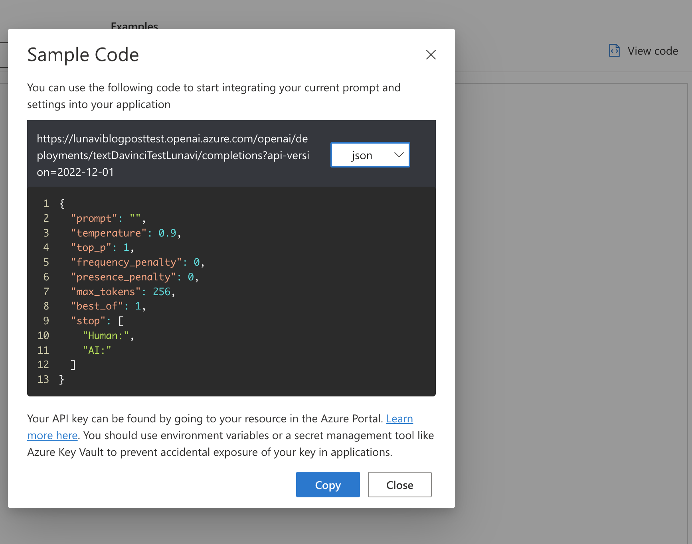
We also want to get the password for this so we want to exit the play ground and go back to our service in the portal. You can find the key here and we will need it for later.
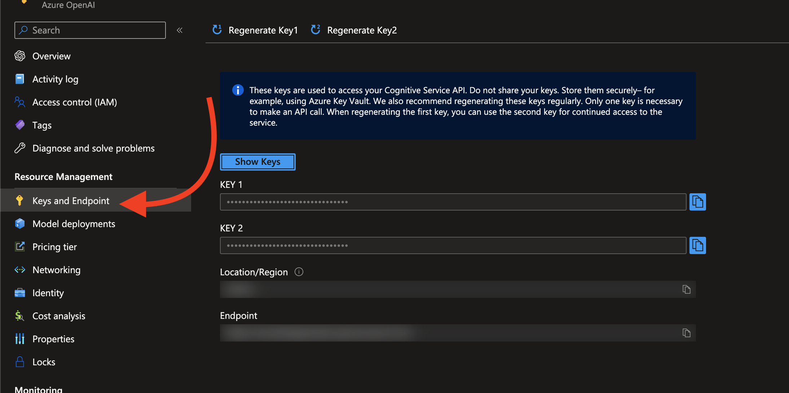

Now we want to create our logic app. Here is the high order of steps.
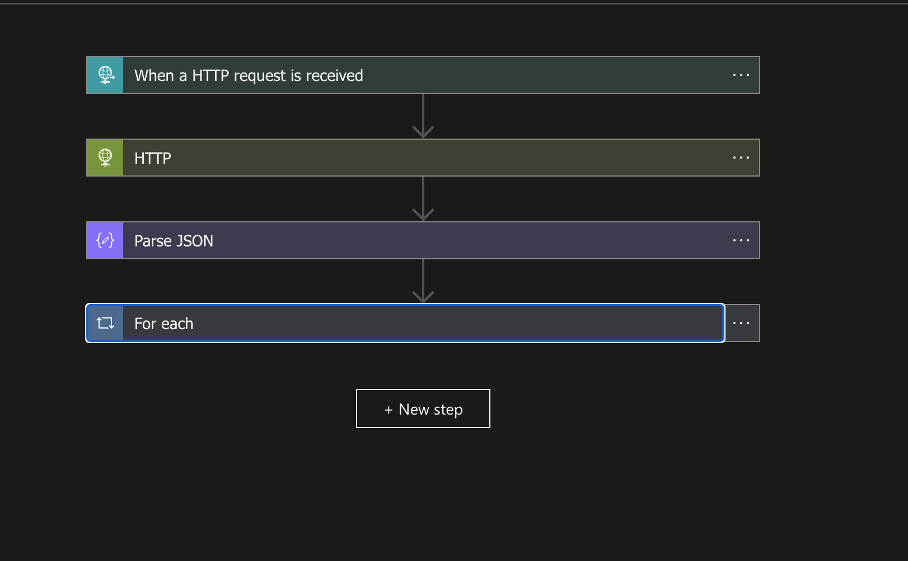
We want to start with an HTTP request is received. That will be our ingress to our logic app via post. This URL once this is saved will be used in Twilio after so make sure we save it off for later.
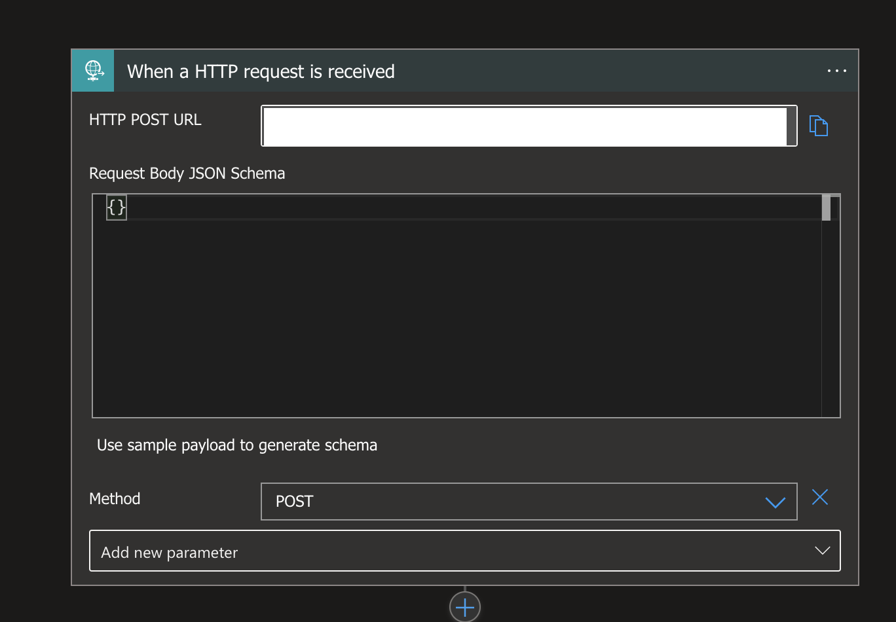
Now we want to send the text we get in from Twilio to our AI service that will look like step 2!
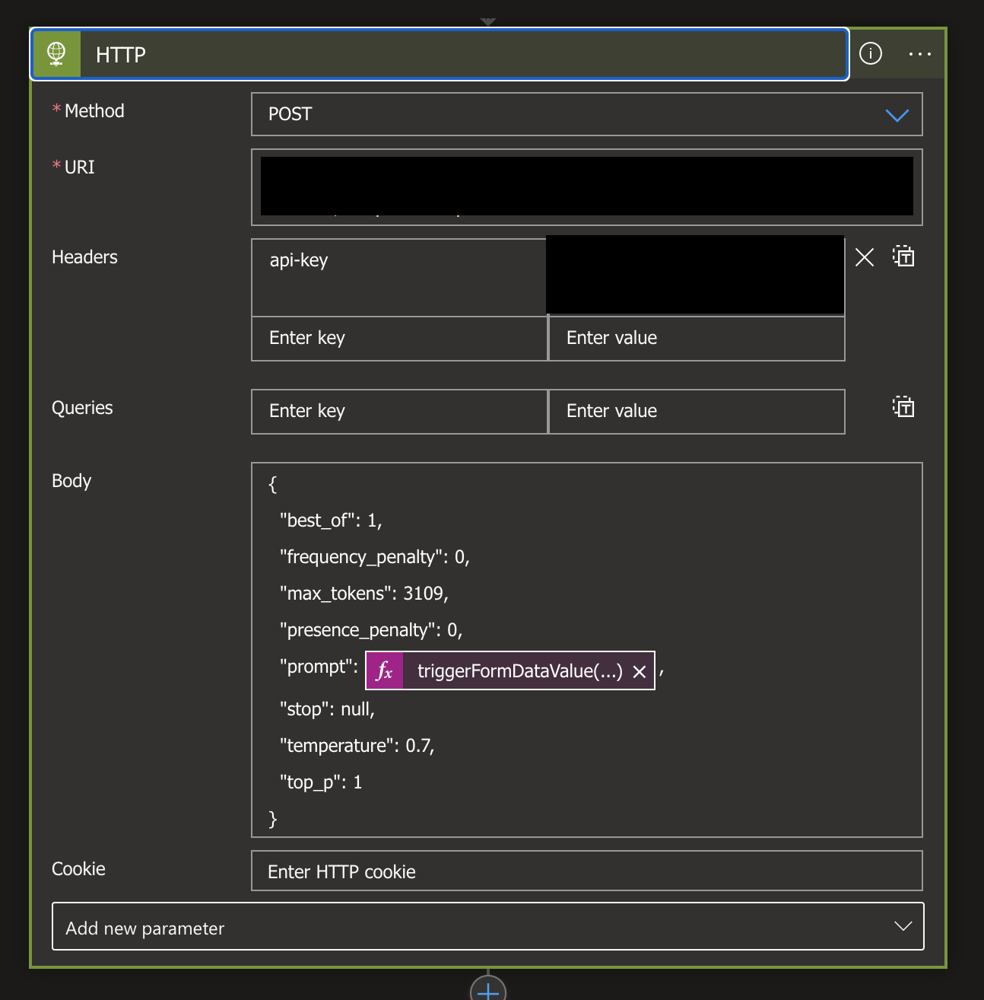
After this we'd want to parse the JSON we get back from the AI service so we can evaluate it.
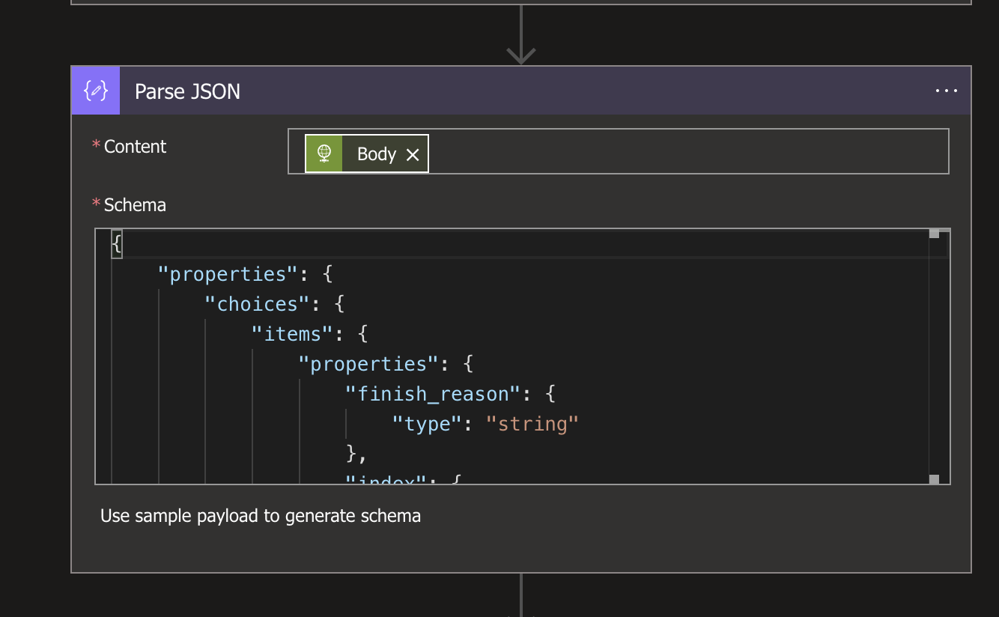 you can use the payload from the playground to map this json.
Finally we want to have a for each.
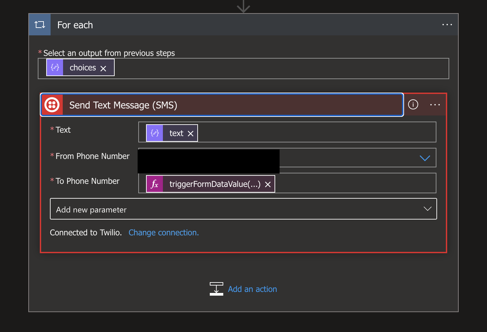 Inside of the foreach we are going to sign into Twilio and send the response back. This is due to AI's model is technically a list since you can have multiple responses (in this case we configured the app to use 1), but just in case you'll be ready to go. Text is the text response, and the to phone number if the from phone number from the original HTTP ingress.

#### Twilio Part 2
Now we finally need to configure where Twilio sends texts when we receive them.
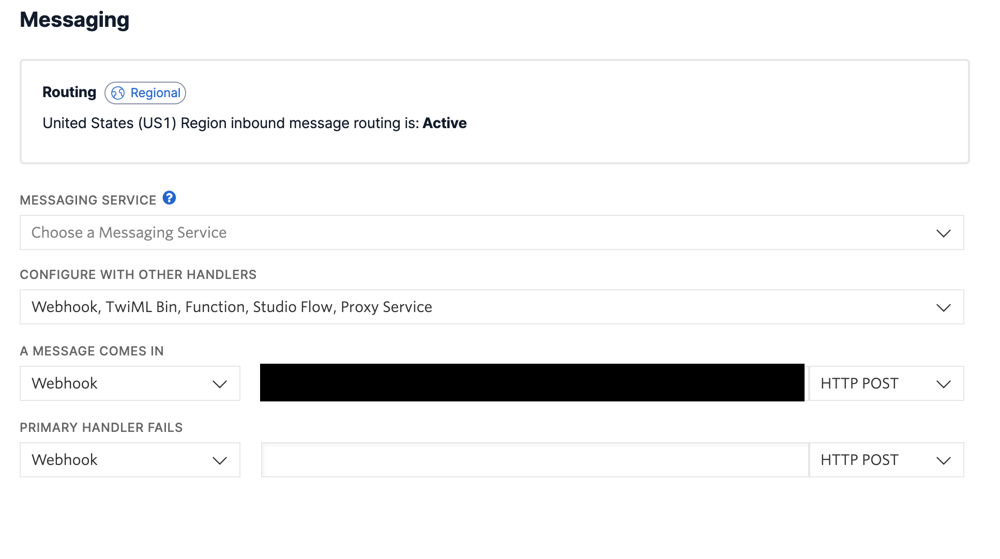 Now we are finally configured! Assuming things worked well we can fire a request and get a text back! 
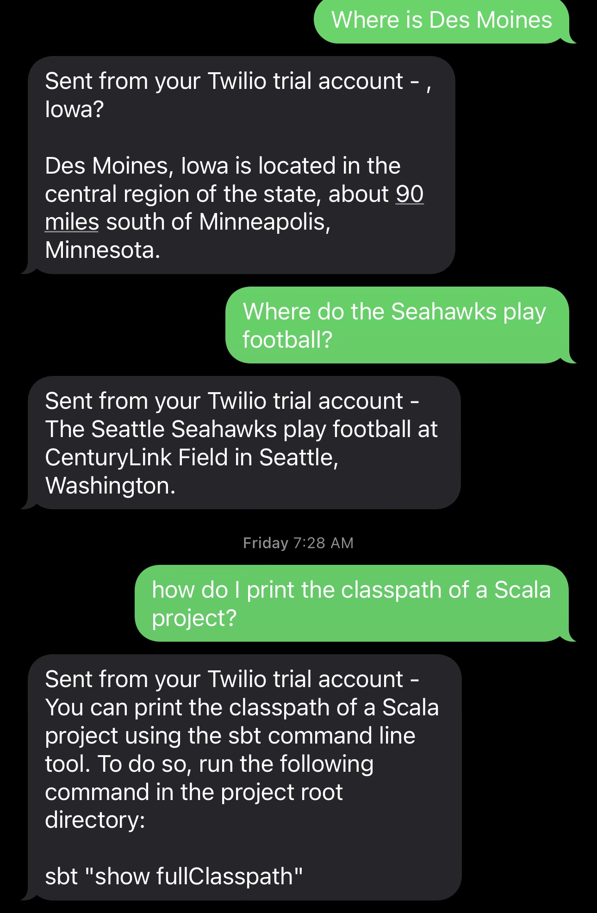

## Helpful Debugging
If you are having issues with your logic app you can exit the designer and see where your run was failing. You can walk through errors in the logic app that would look like this.
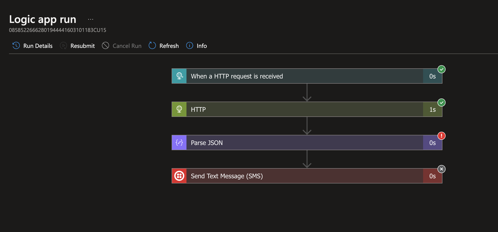
If you don't see the error here Twilio also has a monitor section that looks like this.
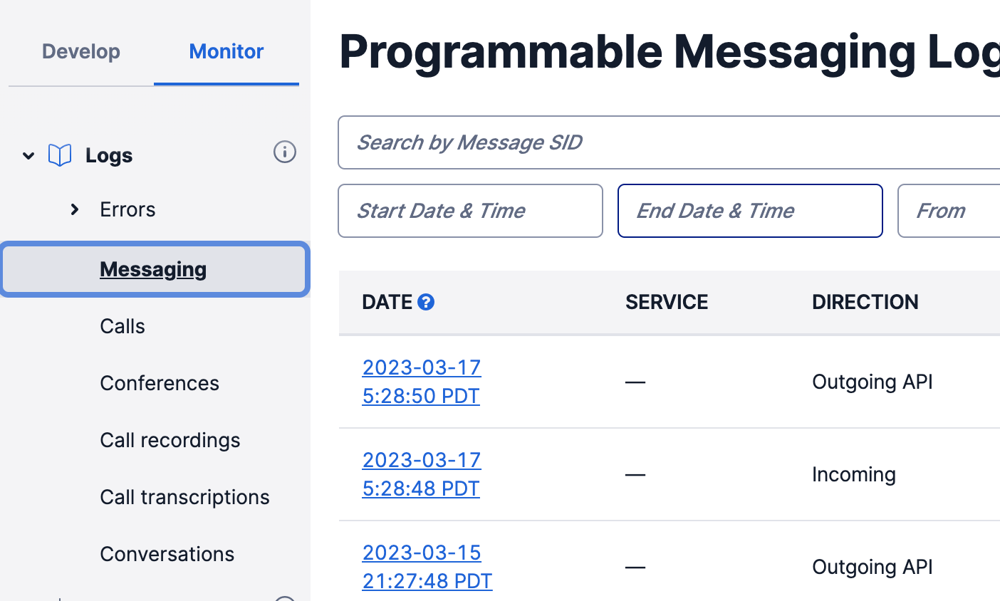

## Conclusion
Now in these two hours you are able to create an AI powered search engine that in the late 2000s raised over $6 million in funding from right out of the gate and this whole solution will cost you almost nothing!