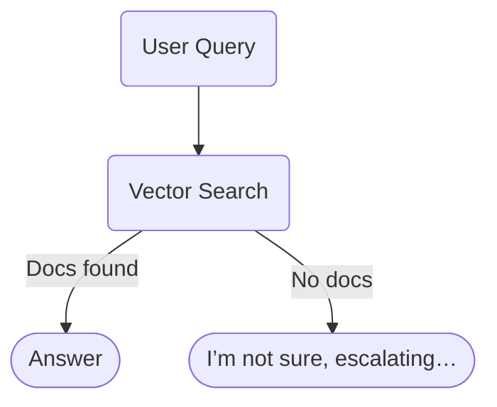
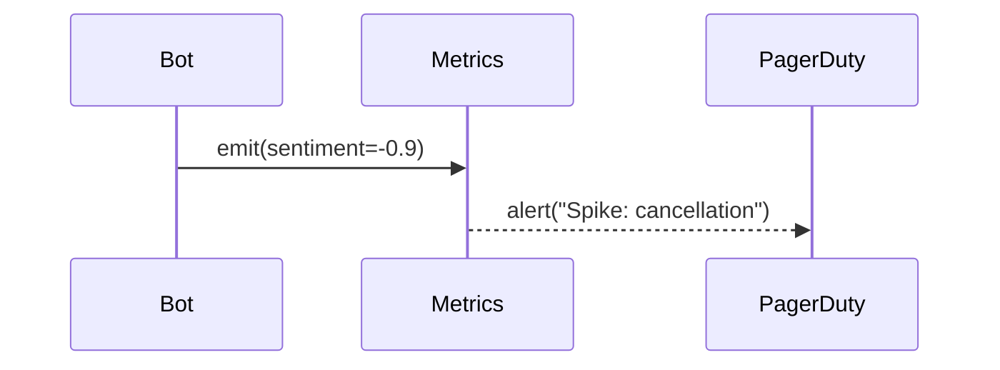

# When an AI Chatbot Burns Cash: Lessons From Cursor’s "One‑Device" Fiasco

> **TL;DR**  
> Cursor’s support bot hallucinated a brand‑new licensing policy, sparking a Reddit revolt and a wave of cancellations.  
> This post unpacks *what went wrong* and delivers a practical playbook for building customer‑facing AI assistants that **don’t** torch your revenue—or your reputation.


---

## 1. What *Actually* Happened?

Last week a Cursor user opened a routine support ticket:

> *“Why does the app log me out every time I switch computers?”*

Cursor’s chat agent—introducing itself as **Sam**—confidently replied:

> *“Per policy, each paid account is locked to a single machine.”*

The policy didn’t exist. The user posted the exchange on Reddit; frustrated devs canceled en masse; the thread went viral—then vanished after an official *“Oops, that was wrong.”* But the damage (and churn) were already done.

### Timeline Snapshot

| Time | Event |
|------|-------|
| 0 h  | User asks support bot about frequent logouts |
| +1 min | Bot invents a **one‑device** rule |
| +10 min | Reddit thread surfaces, anger snowballs |
| +4 h | Human Cursor staff discover the post, clarify policy |
| +? | Unknown number of subscription cancellations |

> **Key takeaway:** A single hallucination cascaded into real revenue loss within hours.

---

## 2. Why Did the Bot Hallucinate?

| Root Cause | Description |
|------------|-------------|
| **Loose retrieval settings** | Bot had freedom to improvise when docs fell short |
| **No confidence threshold** | It responded *anyway* instead of saying *“I’m not sure…”* |
| **Opaque identity** | The agent posed as a human (“Sam”), lowering user skepticism |
| **Lack of live oversight** | No real‑time alerting caught the surge of identical complaints |

AI systems aren’t *malicious*—they’re text‑prediction machines. When we fail to define guardrails, they’ll happily fill gaps with creative fiction.

---

## 3. Design Principles to Keep Your AI *On Script*

### 3.1 Ground the Model With **Strict Retrieval**

* Use a low‑temperature setting and narrow *strictness* controls (Azure OpenAI offers a 1‑5 scale).  
* Embed only **vetted** policy and product docs into your vector index.  
* For any query that retrieves **0** relevant chunks, instruct the bot to *decline*.



### 3.2 Give the Bot an **Escape Hatch**

> "I don’t know" is cheap. A hallucination is expensive.

Add explicit logic:

```pseudo
if confidence < 0.8:
    reply("I’m not sure — sending this to a human.")
    escalate(ticket)
```

### 3.3 **Human‑in‑the‑Loop** Escalation

* Route low‑confidence or policy‑related questions to support staff.  
* Let humans *approve* or *edit* AI‑generated drafts before they ship.


### 3.4 Real‑Time **Sentiment & Anomaly** Monitoring

* Stream all chat metrics to Application Insights or Datadog.  
* Trigger alerts on spikes in negative sentiment or repeated keywords like *“cancel”*.



### 3.5 Automated **Groundedness & Safety** Tests

* Generate synthetic edge‑case queries (hate speech, policy loopholes, etc.).  
* Run them in CI/CD and **fail the build** if the bot hallucinates or violates policy.

```yaml
# azure-content-safety.yml
- task: RunGroundednessTests@1
  failOnUnGrounded: true
```

### 3.6 Continuous **Knowledge‑Base Improvement**

1. Log every *“I don’t know”* response.  
2. Have SMEs draft the correct answer.  
3. Add it to the vector store → fewer gaps next time.

---

## 4. A Reference Architecture (Azure‑Flavored)

| Layer | Azure Service | Purpose |
|-------|---------------|---------|
| Retrieval | **Azure AI Search** | Vector + keyword hybrid search |
| Language | **Azure OpenAI GPT‑4o** | Generates draft answers |
| Orchestration | **Azure Functions** | Implements confidence logic & escalation |
| Monitoring | **Application Insights** | Logs, sentiment, anomaly detection |
| Safety | **Azure AI Content Safety** | Hate, harassment, groundedness tests |
| Human Review | **Power Automate** / Zendesk | Routes escalations to support agents |

> *Swap in your preferred cloud services—principles stay the same.*

---

## 5. Conclusion

Cursor’s glitch wasn’t a one‑off curiosity; it’s a warning shot for *every* team shipping generative AI.  

If you don’t set guardrails, your model will eventually invent something that costs you money, customers, or worse.  

Build with *strict grounding*, *transparent identity*, *human oversight*, and *continuous testing*—and your AI helpers will stay helpful.

---

### 🎧 Want the Audio Version?

I dive deeper—complete with war stories—in the latest **Azure Cloud Talk** episode.  Give it a listen and protect your bottom line before the next hallucination hits.

*Subscribe on your favorite podcast app → [here](https://azure-cloud-talk.simplecast.com/episodes/cursor-ai-support-bot-sparks-wave-of-cancellations-25-04-28)*

