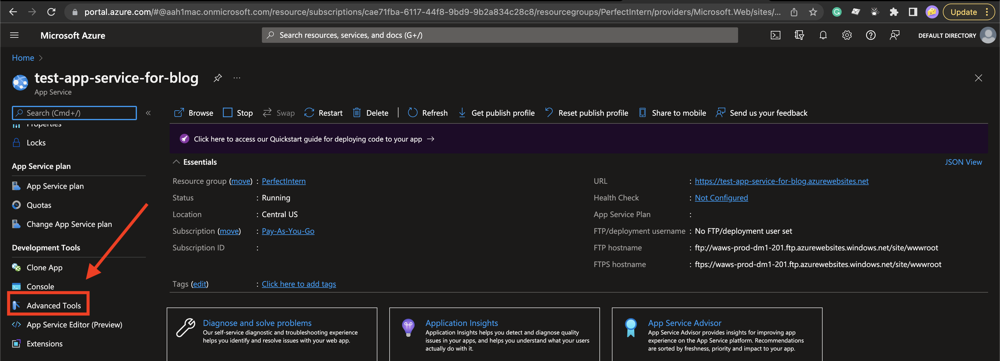
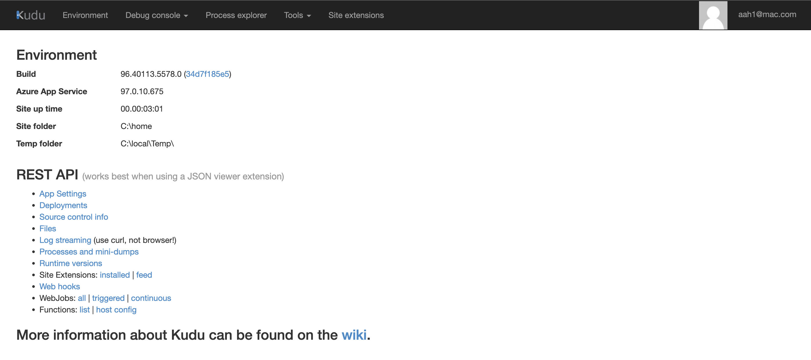
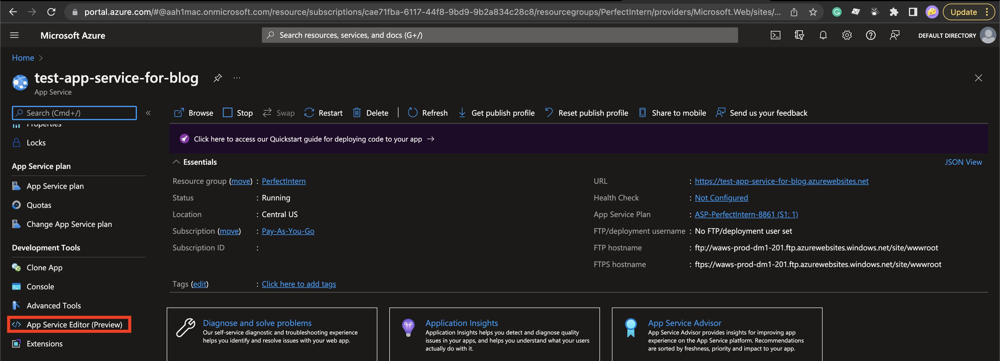
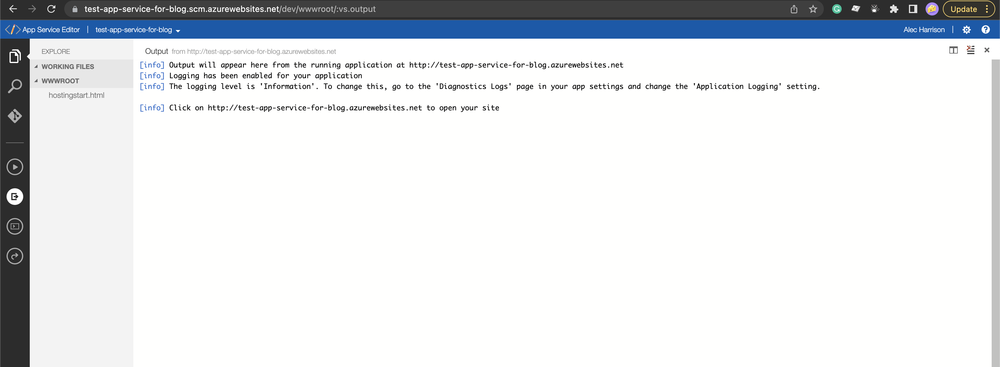

## Debugging App Services

There are a few different tools that Azure provides to help you debug app services. However, without working in Azure you may not have had or stumbled on the tools that are there to help you figure out what's going on.

### Kudu Console

The first tools and slightly older one is the Kudu console. You can navigate it a few different ways. The first and easiest is in your url add .scm before the .azurewebsites section of your site. For example in this photo you see our test app service URL is https://test-app-service-for-blog.azurewebsites.net so the URL to get to our Kudu console is going to be https://test-app-service-for-blog.scm.azurewebsites.net/

At a high level the Kudu wiki is located [here.](https://github.com/projectkudu/kudu/wiki) The console looks like this! 
This page has some more of the old school .Net Framework debugging items. You can look into the appsettings, deployments, source control info, and a bunch of other items und the REST API. There are also many headers.

##### Environment

This section houses a lot of the information about the machine running your application. This shows app settings, connection strings, environment variables, path, request, and http headers.

##### Debug console

This section shows you the files that are on your server. You can download, investigate, and have a console into the server. This can help you investigate issues and check on overall configuration settings.

##### Process Explorer

You can look at any tasks/process running on the server. That will allow you to profile your tasks, check the properties of the tasks, and see how much memory each is using.

##### Tools

There are few tools in here such as dumping logs to your local computer. There are also tools in here for zip deploys and a deployment script. You can also restart your site from this view.

##### Site Extensions

You can look into different extensions for your app service. Depending on what you are trying to do there are extensions for things like Datadog, .net run time, and other packages that usually come along with nuget packages.

### App Service Editor

The next section for debugging is the App Service Editor. This is in preview so some things might be subject to change. To get there via URL is more difficult for our sample URL of you instead go to https://test-app-service-for-blog.scm.azurewebsites.net/dev/wwwroot/. Instead you can navigate here via the UI!  This page looks like this  This page is super cool when you deploy a real app. Because my app service doesn't have code here there is no files. However, you can do a lot from this view. You can see all of the DLLs, appsettings, and even some HTML for your app! This is really cool with HTML apps or other apps that you can make minor changes in a deployed environment before you re-trigger everything. Another thing I've used this for is checking out the appsettings.json to validate things have been subbed and deployed correctly. Depending on how locked down it is you can also change make changes and see them go live without having to fully redeploy your apps. You can also add and remove DLLs (I wouldn't recommend doing this but you can).

### Summary

Overall both of these tools have slightly different use cases, and have a lot of overlap. I would recommend if you don't know both exist to use the App Service Editor. Since it's in preview I believe that means it will be around longer than the Kudu console. That is totally just my guess though. I hope this helps you debug your app services in the future!
