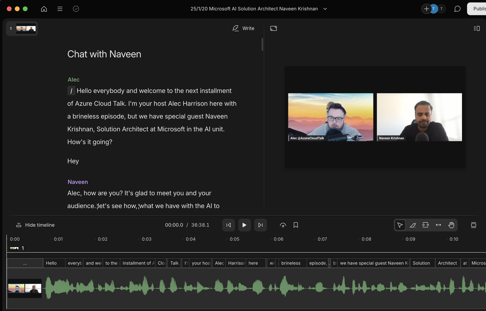
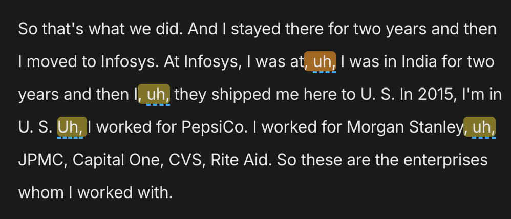

# First Impressions
The first thing that struck me about Descript was its clean, user-friendly interface. From the moment I launched the app, I felt guided through each step:

- Drag-and-drop to import audio or video files.
- A minimalistic editing timeline that reduces visual clutter.
- A straightforward tutorial that walked me through the basics (transcription, editing, and exporting).

Despite the slick design, I did encounter a bit of a learning curve understanding some of its advanced features (like Overdub and Multitrack editing). But once I got the hang of the basics, each new feature felt like a logical extension of the core toolset.

## Transcription Magic
Descript’s transcription functionality is one of its major selling points. I was genuinely impressed by:

- **Speed**: Descript turned my 30-minute audio clip into text in a matter of minutes.
- **Accuracy**: While no transcription is perfect (especially if your audio quality is spotty or there’s heavy background noise), Descript’s accuracy level was typically solid. Occasionally, I’d see mistakes with names or technical jargon, but I could easily correct those as I reviewed the text.

By treating the transcript as the primary workspace, it flipped the editing process on its head: instead of searching waveforms or scrubbing back and forth, I was simply editing text. It felt surprisingly natural and saved me a ton of time.

## Text-Based Audio & Video Editing
One of the things I love most about Descript is the ability to edit audio and video by editing text. Here’s how it works in practice:

1. Import your file – I brought in my raw podcast audio or video footage.
1. Generate the transcript – Descript does its transcription magic.
2. Delete text to delete segments – Anytime I want to remove a sentence or an awkward pause, I highlight the text, press backspace, and boom—that section is gone from the audio or video timeline.

The AI tools were pretty amazing. I was able to auto-magically just be able to remove any and all filler worlds. 

Using this I won't ever have filler words in a podcast ever again, and that I can easily remove in under 3 minutes. 

## Overdub: A Peek into the Future
I have to admit: I was skeptical when I first heard about Overdub—Descript’s AI-driven tool that lets you create a text-to-speech model of your own voice. But after recording a few minutes of my speech to train the model, I was blown away by:

- **Convenience**: If I needed to fix a word or short phrase in my audio (like a date or someone’s name), I could type the correction, and Overdub would seamlessly blend it into the recording.
- **Quality**: While Overdub still has that subtle “AI” lilt, it’s impressive how natural it sounds, especially for short patches.

I wouldn’t rely on Overdub to replace entire lines of script (at least, not yet), but for quick fixes, it’s a lifesaver. It makes the editing process smoother and saves me from having to re-record entire segments to correct a minor slip of the tongue.

## Collaboration Features
Descript also shines when working with a team:

- **Shared project folders**: I was able to keep all my ongoing projects organized in one place, easily accessible to collaborators.
- **Real-time collaboration**: Multiple team members can make edits, leave comments, and highlight suggestions directly in the transcript, much like a Google Docs experience.
- **Recording Space**: You are able to record directly to Descript. This feature is in beta, but that way you don't have to worry about getting your recording to Descript. 

## Points of Friction
No tool is perfect, and Descript has its quirks:

1. **Occasional Sync Delays**: Every once in a while, especially with longer files, there can be a lag between the transcript and audio playback. It’s not a deal-breaker, but it can be a bit jarring.
1. **Subscription & Export Limitations**: Some of the advanced features (like higher transcription hours or Overdub) require upgraded plans. While this is understandable, it can become costly if you’re a heavy user.
1. **Reliance on Cloud**: Since most transcription and Overdub processes happen online, you need a reliable internet connection to get the most out of Descript. If you’re on a shaky network, you might hit some bottlenecks.
2. **Laggy Editing At Times**: When using the browser version of the video editor I noticed a lot of latency when sliding to different parts of my clip.

## Who Is Descript For?
Based on my experience, Descript is a fantastic option for:

- **Podcasters and content creators** who want a streamlined workflow.
- **Video editors** looking for a simpler way to create rough cuts.
- **Interviewers or researchers** who frequently need quick, accurate transcripts.
- **Collaboration-minded teams or freelancers** who want to reduce the back-and-forth of editing.

## Final Thoughts
Descript has definitely changed the way I approach audio and video editing. The text-based workflow and AI-driven features that are more than just novelty—they’ve genuinely sped up my processes and made editing more intuitive. While I still occasionally use traditional editing software for final polishing, Descript has become an essential first step in my production pipeline.

If you’re looking to **streamline your editing** and reduce time spent scrubbing through waveforms, Descript is absolutely worth a try. From its user-friendly interface to advanced AI tools, it offers something new, refreshing, and undeniably powerful for content creators of all kinds.

**Have you tried Descript yet?** If so, I’d love to hear about your experiences—what worked, what didn’t, and how it fits into your current workflow. Share your thoughts in the comments!