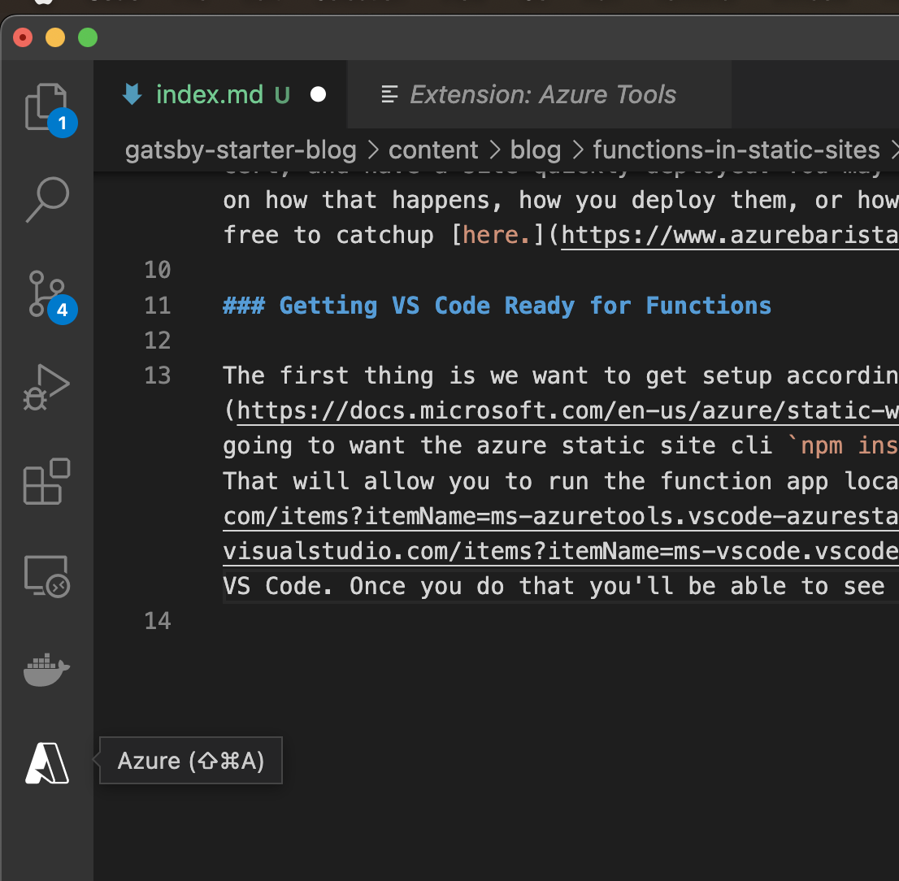
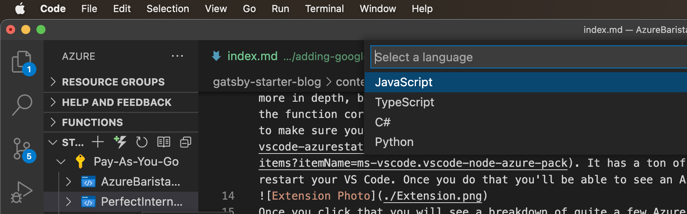
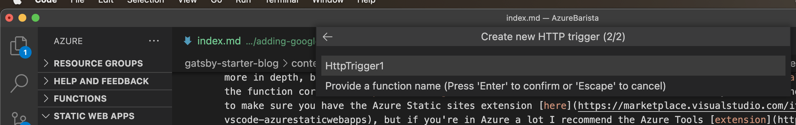
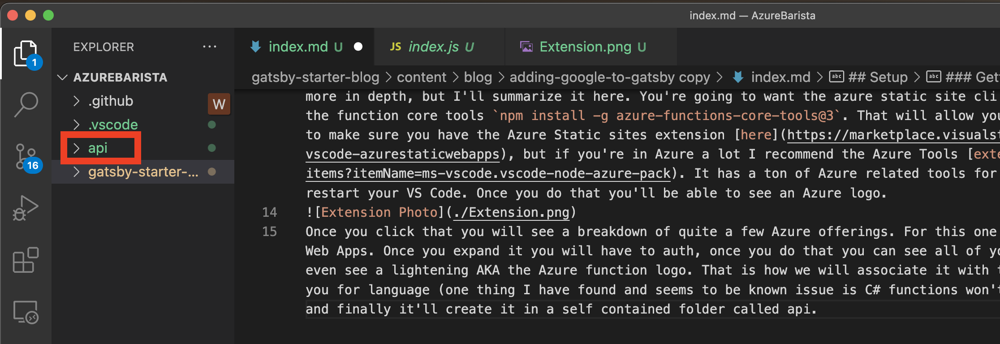
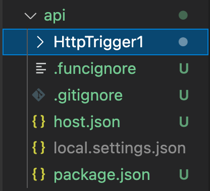
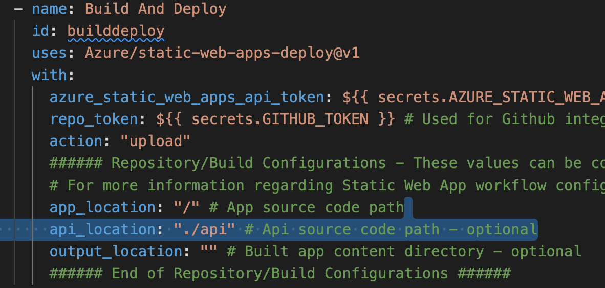
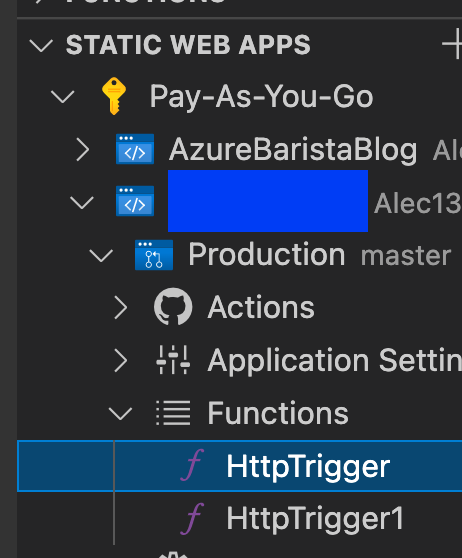

## Setup

If you have read or attended my other talk on Azure Static sites you might know that static sites are a super sweet way to host a site in Azure, get a free HTTPS cert, and have a site quickly deployed. You may also remember I mentioned something about Azure Functions as being a part of an API. I did not really go in depth on how that happens, how you deploy them, or how you test them locally. That is what this blog post is about. If you have no idea what I'm talking about feel free to catchup [here.](https://www.azurebarista.com/deploying-sites-to-azure-cheap/)

### Getting VS Code Ready for Functions

The first thing is we want to get setup according to Microsoft to make this as slick of an experience in VS Code as possible. That list of requirements are [here](https://docs.microsoft.com/en-us/azure/static-web-apps/add-api?tabs=vanilla-javascript) if you want to read more in depth, but I'll summarize it here. You're going to want the azure static site cli `npm install -g @azure/static-web-apps-cli` and the function core tools `npm install -g azure-functions-core-tools@3`. That will allow you to run the function app locally. Next you want to make sure you have the Azure Static sites extension [here](https://marketplace.visualstudio.com/items?itemName=ms-azuretools.vscode-azurestaticwebapps), but if you're in Azure a lot I recommend the Azure Tools [extension](https://marketplace.visualstudio.com/items?itemName=ms-vscode.vscode-node-azure-pack). It has a ton of Azure related tools for you to use. Then you will likely have to restart your VS Code. Once you do that you'll be able to see an Azure logo.

Once you click that you will see a breakdown of quite a few Azure offerings.

For this one we are going to be interested in Azure Static Web Apps. Once you expand it you will have to auth, once you do that you can see all of your apps so far. If you hover over one you'll even see a lightening AKA the Azure function logo. That is how we will associate it with this project. Once you click on that it will ask you for language (one thing I have found and seems to be known issue is C# functions won't work on Mac OS), then it'll ask for a name,

and finally it'll create it in a self contained folder called api.

You can also deploy it from the previous window, but where's the CI/CD in that?! However, before we get ahead of ourselves let's investigate what was created for us.

### Auto Generated Function App

First things first if you need more than one endpoint if you repeat the process we just did N times you will get N functions and it's smart enough to put them in the same API folder. This is cool because as you add more and more functions it's smart enough to just add the parts you need!

#### Top Level

The overall layout of this folder is similar but may vary slightly depending on language. For example (starting at the bottom) we have a package.json. That is only the case for JS or TS functions since you don't really need JS dependencies for others. Next, we have local.settings. Nothing crazy there it's ignored in git by default. Next you have host.json that has some default settings, but it's basically saying your new functions will be enabled on deploy. However, that file can be much more complex if you want/need it to [be](https://docs.microsoft.com/en-us/azure/azure-functions/functions-host-json). After that we have a .gitignore and a .funcigonre. Similar concepts one ignores things for git, one for functions. Lastly, we have the function we made (in this case HttpTrigger1).

#### Digging into the function

This has the function.json file, and by default it is open to the world. We want to probably reduce that soon. In there is also the type of function we have httpTrigger here, but that can be a lot of things like, state change, timer trigger, [etc](https://docs.microsoft.com/en-us/azure/azure-functions/functions-triggers-bindings?tabs=csharp). Then we have direction since we are being hit, by default it's in. Next the name in that bindings, followed by the HTTP methods we accept. Last in the function.json is the response code back of type HTTP and out since it's going back to whoever hit us. After that file is done and over with you have the default index.js (imagine that is like a main) whatever is in there will run when hit. Finally a .dat file telling you Azure. Now that that's all settled it's time to deploy this bad boy.

#### Deploying

This is going to be super anti-climatic assuming you've seen my other blog post. All you do is add the api location to your static site deployment.

Once that is done it will deploy your functions to the URL of your static site/api/{your name} if you use the example it'll be site/api/httptrigger1. Once that is done you can go back to your azure extension and see it deployed under the app you expect it to be. You are then ready to rock and roll!

### Conclusion

This cloud concept should allow you to have everything in a very small, cheap, and easy to understand micro service arch moving forward. This whole flow and app is now a frontend and API with 0 fixed costs, and strictly a consumption model that should be able to scale as your needs do. Sometime in the future I might just explore SQL servers on consumption plans.
