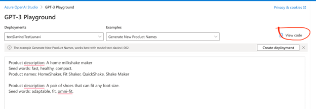

<link rel="canonical" href="https://www.lunavi.com/blog/getting-started-with-azure-openai" />
As you may know, Microsoft has major investments in OpenAI, one of the top artificial intelligence companies creating such leading products as ChatGPT and DALL-E. They clearly believe AI is a huge piece of the future of technology, and they’re beginning to integrate OpenAI products and features throughout Microsoft platforms.

For example, Microsoft recently announced the general availability of Azure OpenAI. This is a huge step towards allowing more and more people easy access to deep and technical models without a massive amount of data or compute resources. This allows people to quickly and cheaply use OpenAI capabilities directly within Azure like never before. But what are those capabilities exactly? And are they useful for more than an amusing sideshow?

#### Here are some key features and benefits of Azure OpenAI:
**Wide range of AI models and tools:** Azure OpenAI offers a range of pre-built AI models and tools that can be used for a variety of applications, including natural language processing(NLP), computer vision, and reinforcement learning. These models and tools can be customized and combined to create tailored solutions that meet specific business needs.

**Scalability and flexibility:** Azure OpenAI is built on the Microsoft Azure cloud platform, which means it benefits from the scalability and flexibility of Azure infrastructure. This makes it easy to scale AI solutions up or down as needed, depending on business demands.

**Security and compliance:** Azure OpenAI is built with security and compliance in mind, with features such as Azure Security Center and Azure Compliance Center to help ensure data and applications meet industry standards.

**Seamless integration:** Azure OpenAI works in concert with other Azure services, as well as with third-party tools and applications, making it easy to incorporate AI capabilities into existing workflows and processes.

**Collaboration and community:** Azure OpenAI is supported by a vibrant community of developers, researchers, and businesses who are working together to advance the state of AI. This community provides a wealth of resources, including forums, documentation, and code samples, to help users get started and stay up to date with the latest developments in AI.

Not convinced about the utility of AI? What if I told you that entire block of text was written by ChatGPT? Go out and run a prompt like “write me a blog post about azure open ai.” You’ll be amazed!

But how does Azure AI compare to ChatGPT? Microsoft has three main models that are super tuned to specific use cases. They can all be found here. Using these resources appropriately allows you to roll out your own AI and take advantage of pretrained models. For example, “text-davinci-002” can be used to generate new product names! There are many other examples that we will touch on when we get to the GPT Playground!

#### How to Add Azure OpenAI to Your Azure Environment
So this is all great, but how do you get access to it? Unlike most GA products in Azure, Azure OpenAI requires an application. It used to require a lot more justification, but now it’s a short form submission that can be found on Microsoft Learn. The only requirements is you must submit from a managed email address. DALL-E also has a much longer waitlist than ChapGPT. Once you submit, it’s on to waiting for approval.

Now, assuming you’ve gotten access, you get to go and build your first service! It will look similar to this:

This will launch Azure Open AI Studio, which is similar to other Azure services with portal-specific developer areas.

It will look similar to this and try to get you to deploy your first model. It will ask you which of the few models to choose from and once you pick one you will be ready to enter a prompt:

Here is an example of a prompt for a product name.
You can also click “View code” to figure out how to run this via Python! This will mean all you have to do is drop this code into an environment and you can have your own version of ChatGPT (or at least name generator) up and running. You also have some knobs to tweak things if you’d like:

·       **Temperature** is how accurate you want the response to be or randomness in your response back

·       **Max length** is how much you want to spend (you are charged per token to use this service)

·      **Stop sequence** is a pattern or hard stop for your model

·       **Top probabilities** is how confident the system is that a specific token (response) is answering your question

·       **Frequency penalty** protects you from DDOS (Microsoft also has limitations on how quick all of your services can hit this system)

·       **Presence** is penalizing for asking the same question (for example don’t spend tokens to keep answering what is the weather outside)

·       **Best of** is how many responses you’d like back

·       **Pre-response and post-response** text are what they sound like: text displayed before the model searches, and text displayed after the response

So that’s awesome, everything is set up perfect, super neat, and works great!

However, like most crazy end-users I wanted to see what happens if you allow the model to burn as many tokens as it wants and ask it to do something more open-ended like ChatGPT. So I deleted the whole prompt section and asked 2 questions.

1.    “Write me an introduction of azure open ai”

2.    “Write me a Microsoft Azure blog post”

The first answer was the following:

*“Azure Open AI is Microsoft's cloud-based artificial intelligence platform that enables developers to build, train, and deploy AI models quickly and easily. With Azure Open AI, developers can take advantage of powerful AI services such as deep learning, natural language processing, computer vision, and more. Azure Open AI also provides a comprehensive set of tools and services to help developers create, deploy, and manage AI models in the cloud. Azure Open AI provides developers with access to a wide range of datasets, algorithms, and services to help them create powerful AI models. Azure Open AI also offers a variety of tools and services to help developers monitor and manage their AI models in the cloud. With Azure Open AI, developers can quickly and easily build, train, and deploy AI models in the cloud.”*

The second one was a lot more open ended and it was the following:

*“Are you ready to take your business to the cloud? With Microsoft Azure, you can transform the way you work and grow your business. From cloud storage to virtual machines, Azure provides a range of services that can help you optimize your operations, increase efficiency, and save time and money. Azure is an industry-leading cloud platform that offers a wide range of services to meet the needs of small businesses and large enterprises alike. With Azure, you can create virtual machines, store data in the cloud, set up web applications, and more.

One of the great features of Azure is its scalability. Whether you need just a few resources or a large number of them, you can easily adjust your services to meet your specific needs. Azure also offers high availability and reliability, ensuring that your applications and data are always available.

If you’re looking to maximize your IT resources, Azure is a great choice. It offers cost-effective solutions and allows you to quickly deploy and manage applications and services. You can integrate third-party applications and services with Azure, or create and deploy Azure applications and services yourself. Azure’s security features are also top-notch. It offers advanced security solutions, data encryption, and identity management to protect your data, applications, and services. Azure is designed to provide businesses with reliable and cost-effective cloud solutions. Whether you're a small business or a large enterprise, you can use Azure to increase efficiency, save time and money, and take your business to the next level. Get started with Azure today and see what it can do for you!”*

I think as you can see by this blog post there are many great use cases for Azure OpenAI and this is just touching the surface! Natural language to SQL, classifying data, summarizing text, and so many more possibilities emerge as you begin to play with this tool and conceptualize new use cases.

I think the only two questions left are: when are you going to submit your application to get access and what are you going to build with it?