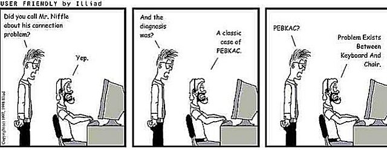
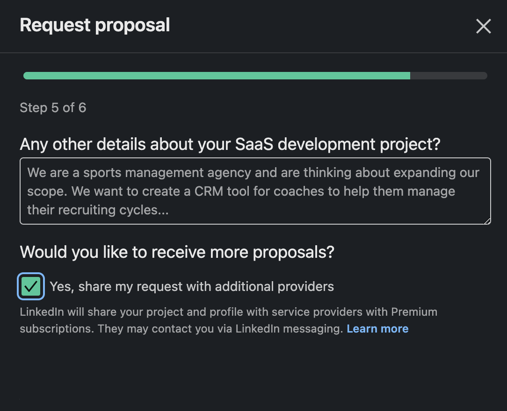

Image Credit [Major Geeks](https://www.majorgeeks.com/content/page/pebkac.html)

## Before We Get Started
Let me just say if you need help with anything Azure, AI, or anything in MS Stack (Copilot Studio, .Net, Angular, Entra) etc. Please feel free to reach out. This is not a rant about people who legitimately need help reaching out. I am always happy to help and not even necessarily charge anything for the help. I am currently an expert in Microsoft For Startups program, and in the program I help founders for free. Drop me a line if you need help with anything tech or software (except printers <unless of course it's to smash them>). 

## My Experience With Linkedin Request For Services
I want to start this post by saying this feedback is given from the standpoint of positive intent. It is easy to nitpick products and platforms about how you'd do things so much differently, but at the end of the day most of us have not built a massively successful social networking platform. So we don't know all of the things that go into just keeping the platform running, bug free, spam free, bot free, etc. I feel like sharing my experience will help in 1 of 2 ways. 

- One show maybe I'm an idiot and using the platform incorrectly. Pebkac errors in IT are a joke, but so apparent because they feel right a lot. 

- Two give honest and transparent feedback of my experience as a person using the tools as they are today.

Are you ready for a ride? Let's begin!

#### Getting Setup
The first thing you have to do to be open to services is create your first service listing. As someone currently with Linkedin premium I kept getting nudged into that direction that I should create some services. So I decided, heck why not give it a try? Worst case I get maybe some moonlighting work or leads for my day job. So I filled it out. 

It has you pick from pre-built categories of what you want to be offering. For me I picked some more general offerings. You then can put in a pitch. Mine was the following "As a Microsoft MVP in Azure and AI, I bring a wealth of consulting experience and a unique perspective to help you unlock the full potential of AI and cloud solutions. I've worked across a wide variety of industries, allowing me to tailor innovative strategies that meet your specific business needs." It cannot be more than 500 words, mine was around 300ish. Next, you pick where you want to work. I am in Omaha, NE so I picked that and fully remote. You can then add your starting rate or put contact for pricing. Then you pick if you want media or reviews public, and finally do you want other Linkedin profiles to be able to message you for free. 

Once you get that setup you are free to start building out your services page! 

One thing I didn't really like about this process is it is 100% setup for you to be an hourly employee. Which is fine, but if you do fixed bid projects or services (like an Azure Audit, Migration, AI implementation <there wasn't an AI role I saw>) you just have to work backwards for that. Not an end of the world, but with some limitation in categories and pricing you'll have to play in those guard rails.

#### Getting Requests
I think this is where I started getting frustrated with this tool. So just a heads up, it might get a little heated. You start getting requests for work, and as a "feature" of Linkedin premium it will send you leads for people who have requested similar services to what you offer. The form they fill out to request services from you is fixed and you have to work with the questions they have. If you click on someone with request for services you'll see there's a default checkbox to send your request to others offering similar work.

In theory this sounds like a great idea. Let's say I want to work with myself Alec Harrison. My project needs to kick off ASAP and let's say in this case Alec is on vacation not checking his Linkedin. Well have no fear that request you as the person looking for help is now sent out to a few premium users. So I not only have competition, but hopefully I can find someone to help me in my time frame. 

Why do I hate this feature? I've gotten at least one notification where someone meant to reach out to someone else (said something similar to Hi Jon I'd love to work with you), or the SPAM! Spam posting is the worst. I end up reporting 95% or more of all requests. They are usually jumbled words, keyboard mashing, or I've gotten a few where people are trying to get a job. Could you imagine going to a job interview and the person set to hire you pulls out an uno reverse card and asks you for a gig? WILD! Most requests that seem like the person requesting help has put a little time into are closed within minutes after Linkedin tells me I got another request. So that leaves me with mostly spam accounts looking for work. 

#### Summarizing My Experience
Overall, I have had one positive lead that started with the Microsoft MVP website of someone looking for an expert in AI and went to Linkedin and saw my "open for services" link. However, they didn't fill out that form, instead they just dropped me a DM. Would they have DM'ed me either way, maybe? So the record I'm currently keeping is 0 direct requests, tons of spam requests, and one possible influenced DM. I am not sure how the client proposals work on the other end of Linkedin, but I can say I've filled out a few and haven't gotten a response from the lister or through the looking for services product. I also heard from [Joshua Berrios](https://www.linkedin.com/in/joshuaberrios/) that he had a very similar experience. Shout out to him check him out! Due to all of that, I have re-listed my website as my custom button. I think I will personally get more out of sharing my blog with people than services. Finally I will be un-publishing my listing on services so I don't get as many spam notifications.