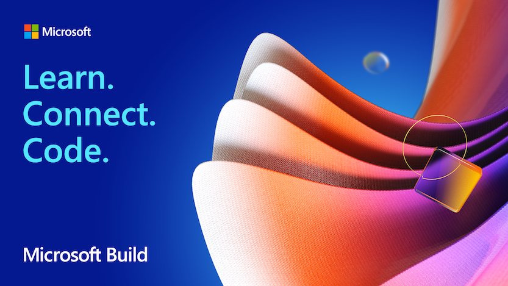

*Copyright Microsoft*

## What is a retro?
Just in case you are new to Agile or don't hold retros (retrospectives) as ceremonies I will briefly describe them. The purpose of a retro is to point out usually in a sprint (period of work you are committing to do) what went well, what didn't, and any praise for the team. You can alter what your questions are, but the goal is to make the team run more streamline. You can apply this mindset to other parts of your life and grow else where too!

## What is Microsoft Build?
According to wiki "Microsoft Build (often stylised as //build/) is an annual conference event held by Microsoft, aimed at software engineers and web developers using Windows, Microsoft Azure and other Microsoft technologies." That's a fancy way to say it was a lot of fan fair and Kool-Aid to go around. That leaves the question was the event worth it? I think I can explain that in a few different ways.

## Fanfair
I think another word for this title can be excitement or genuine entertainment of the presentation. Microsoft Build allows you to build your own track. There are so overarching presentations that everyone goes to, but there are also sessions and round tables for you to see at talk about what you want. For example, I attended a group about the future of VR and it was just a round table to discuss it with experts. There were other round tables too. I was able to fairly easily ask at least one question if I wanted in each round table. The only feedback I had was they were massive so you could connect with the table members, but meeting with other attendees was difficult.

## Connections
One big part of Build that was advertised is a venue for people to connect. I did manage to connect with a few people, but being virtual and the HUGE round tables made networking with other attendees difficult. You had your round tables with say around 4-8 people leading it and then hundreds of other attendees in the round table. So it was hard to connect with other attendees. It was fairly easy to connect with the hosts. I would imagine in person you connect with other people much easier as it's a by product of seeing the same people session to session in the crowds. 

## Preplanning
Microsoft does do a great job of sending out all event info ahead of time and had a fairly nice scheduling assistant for planning your build event. This includes all main stage events and other side round table discussions. I really liked this and it helped build up my own hype for the event as I looked forward to discussions. 

## Was it worth it?
Absolutely! I think next time even being in person I would go for it and say it was worth it. Online it's absolutely worth it. I would highly recommend the event to anyone who uses any Microsoft development products on a daily basis. It hyped me up for the future of development and made me excited to work on my craft! 
