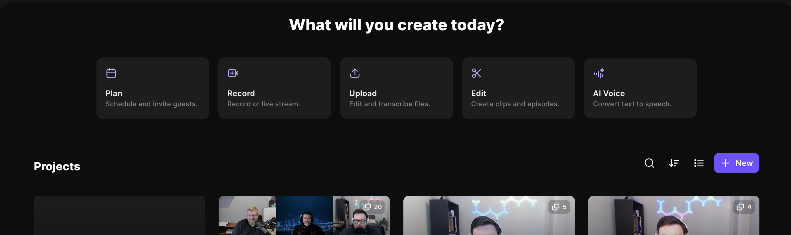
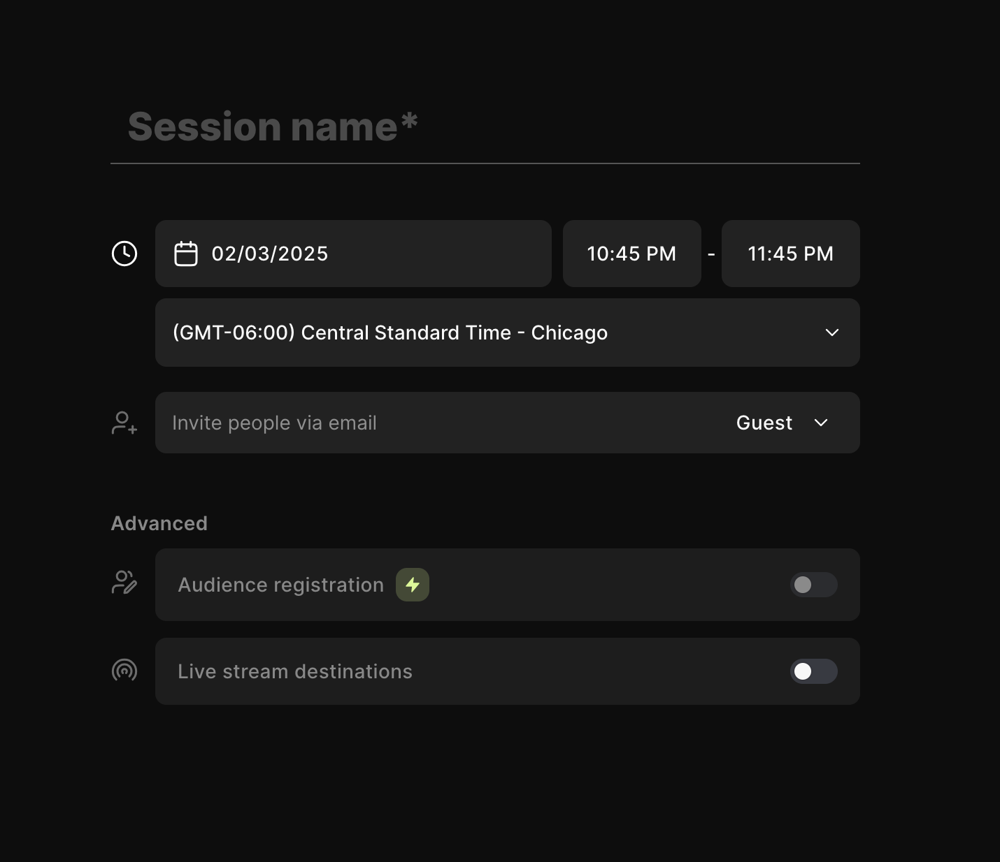
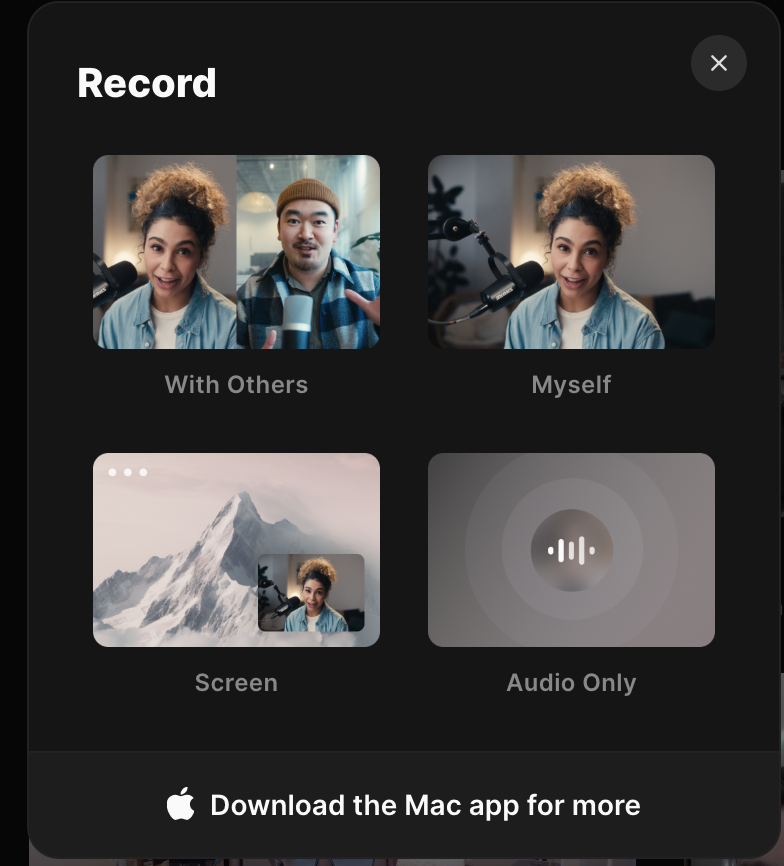
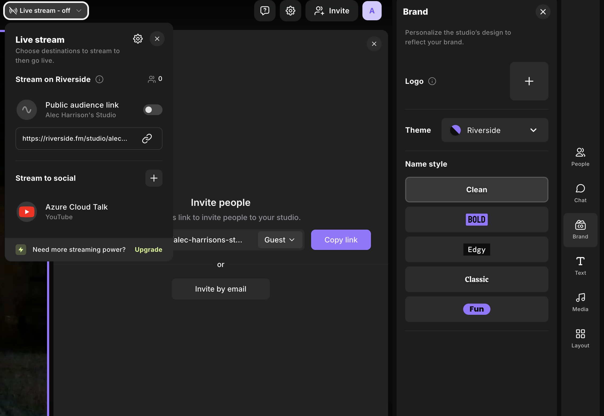
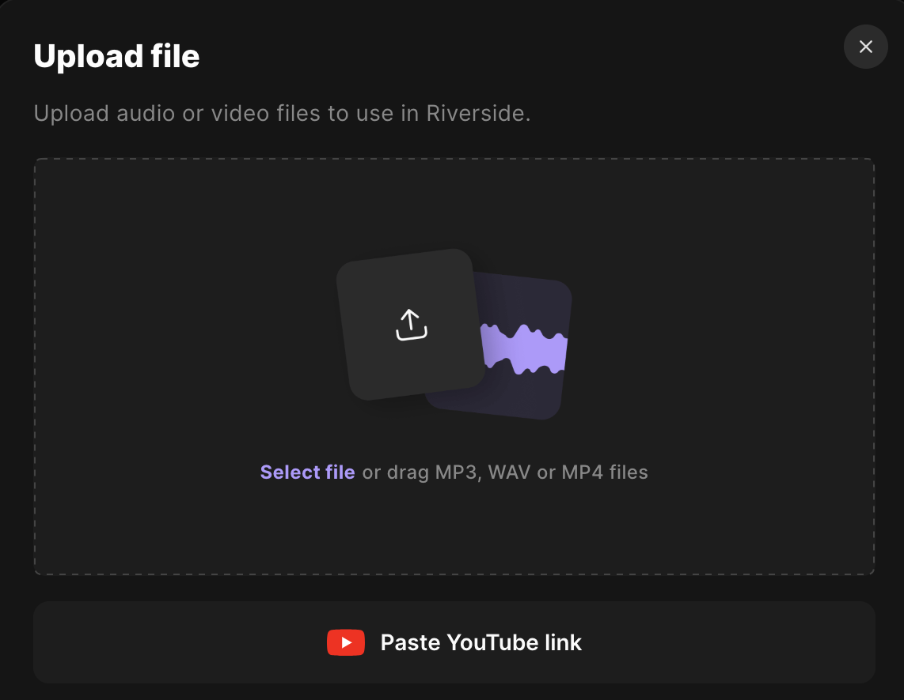
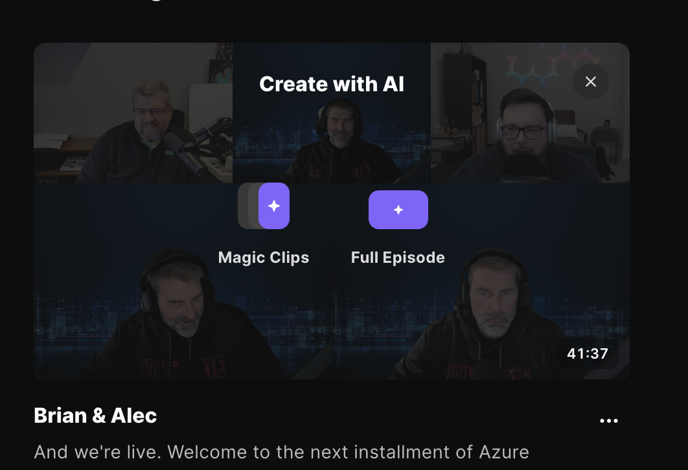
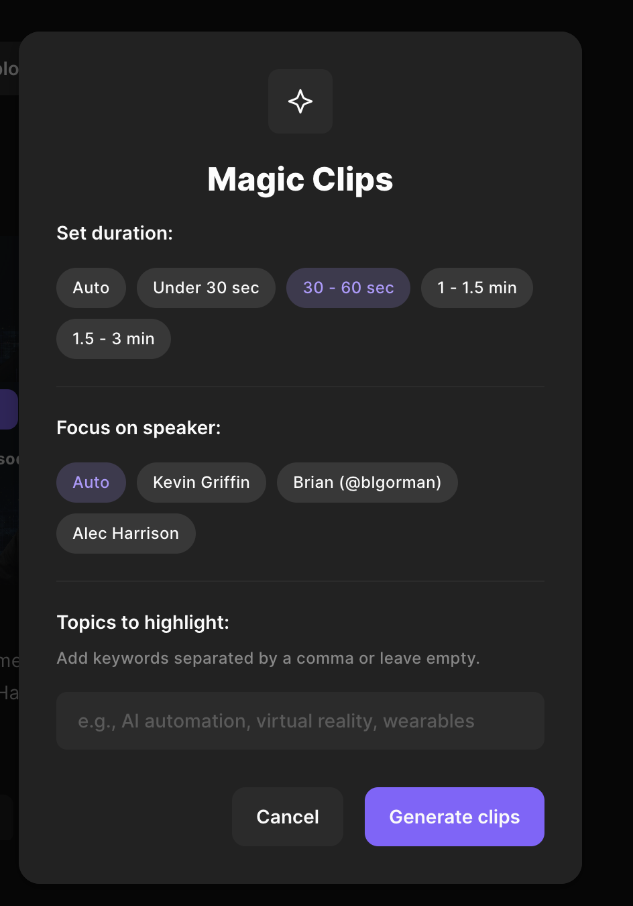
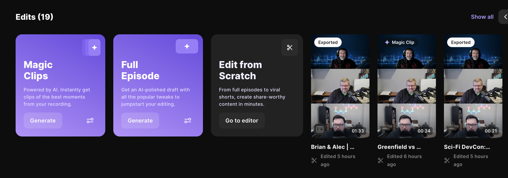

## What is Riverside?

Riverside is a tool that allows you to edit, clip, and cleanup your podcast. I know what you are thinking, why would I need this? Well, I have a podcast and I want to make sure I am getting the most out of my podcast. I also want to make sure I am not spending hours on editing and clipping my podcast. I know I just did a post about how I liked Descript. I almost immediately switched to Riverside and I'll tell you why.

### Overview

#### Plan 
Plan is the first thing you see on the home nav in Riverside. This is where you can create a schedule for a new project. This launched a window like this 

You can set the session name (which is the name of the podcast episode), the date, and the guests. You can also allow audience to register and set livestream locations. That has quite a few locations like YouTube, LinkedIn, Facebook, and even Twitch. 

#### Record
This is pretty self explanatory. This is where you can record your podcast.

You can pick 4 different recording modes. You can record with other, yourself, your screen, or audio only. 

Once you pick an option you will load into the recording screen. 

When you load that you can where you can live stream it, links to invite people, and you have a few options to record your video. You can see the people in your recording, a chat to talk to the audience and your guests, branding, text overlays, media (like images, music, and videos), and you can set the video layout. Once you've recorded all of your guests local content will sync to the cloud for you to edit it later.

#### Upload
Instead of recording or if you have a recoding somewhere else you can upload it to Riverside. You can also link a YouTube video.

#### Edit
Once you're done recording you can edit your podcast. You can start with the full raw recording or you can start with clips!

You can focus on the length of the clip, which speaker you want to highlight, and the topics you want to clip to cover.

This is where you can edit your podcast. You can see the transcript, edit the transcript, add timestamps, and add notes. This is why I dropped Descript. I love that I can edit the transcript and add timestamps. You can pick the ratio of the video or if you want it to be just audio only.

We also have a ton of AI tools to help make your recording sound better. You can use the AI to clean up your audio to remove pauses, stutters, and other noises. You can also use AI to remove pauses, enhance the audio, and more! It makes producing a podcast so much easier. This removes a lot of the variables that can happen when you are recording remotely and you can't control your guests recording equipment, internet, videos, etc. 

Once you're done editing you can publish directly to YouTube, LinkedIn, and more! You can also export it to your computer so you can use it in other tools. 

#### Conclusion
I love this tool. I've been using it for a few weeks now and I've been able to produce a few podcasts with it. It's a little steep at $30/month but I think it's worth it. This tool helps replace Descript, Opus Clips, and more. I'm excited to see what I can do with it! If you want to give it a try you can use my link to get [started for free](https://www.riverside.fm/?utm_campaign=campaign_5&utm_medium=affiliate&utm_source=rewardful&via=alec)!

