<link rel="canonical" href="https://www.lunavi.com/blog/using-azure-ai-and-logic-apps-to-reverse-engineer-sms-search-engines" />
# Background
In the 2000s and early 2010s the world was a strange place. Mobile phones were reaching so many people in so many parts of the US and texting was quickly becoming the way people communicated. Lol, OMG,BRB, etc., were all being engrained in the lexicon of the world. Now that mobile networks were speeding up and texting was becoming more common, unlimited texting quickly became common. This is around the time the first iPhone came out and smartphones weren't nearly as mainstream as they are today. That means web browsing was super expensive on mobile devices if you could even get it.

In this emerging market came ChaCha, a search engine that you could text via SMS and get a response back to your questions. "Users were able to send an SMS message with their question to 242–242, where Guides would then answer it. Standard messaging fees could apply, but ChaCha never charged additional fees." The company raised $6 million.

Now instead of guides and droves of freelancers, we instead have AI chatbots powering our answering services. You can even create a text message answerbot right in Microsoft Azure using native PaaS components in a matter of hours. Let’s find out how.

## Requirements To Begin
AZURE SUBSCRIPTION
1. Azure Open AI Services

2. Azure Pay As You Go Account

Note: there is a way to use Azure Communication Services to do this if you want to be completely Azure-native, however this will cost you a couple dollars a month to get an SMS number.

TWILIO ACCOUNT
We are going to use a trial account for two-way SMS communications.
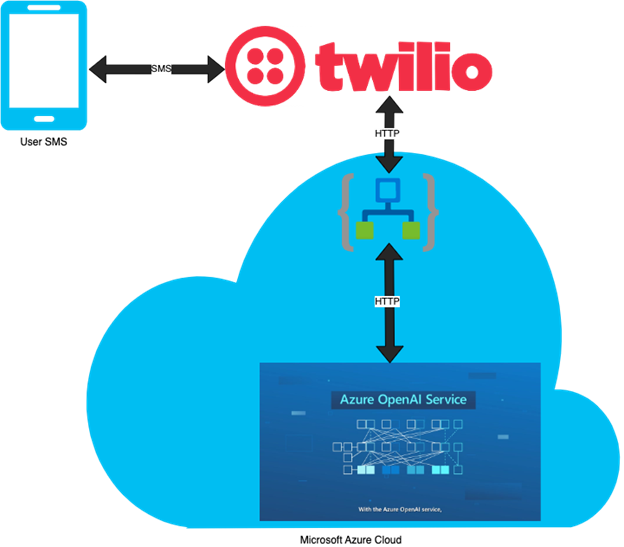

Our architecture diagram demonstrates how our userswill send questions via SMS to our Twilio number. That number will then triggera post request to an Azure Logic App, which will pass our request along toAzure Open AI Service.

## Setting up the solution
### TWILIO PART 1
To start off, we need to sign up for a free Twilio account, if you don't have one already. We want to make sure we get a phone number and make sure it is active for two-way SMS. Once you have your number we need to go to Azure to setup up Open AI and our Logic App.

### AZURE
If you don't have access to Azure Open AI, you can request it here. As of right now it is GA (general availability), but you do have to request access to it.

The first thing we want to do is to create an Azure Open AI service in Azure Open AI Studio. Then, we want to make sure we deploy a New Model.

You can deploy text-davinci-003 as a good general model for a Q&A service.
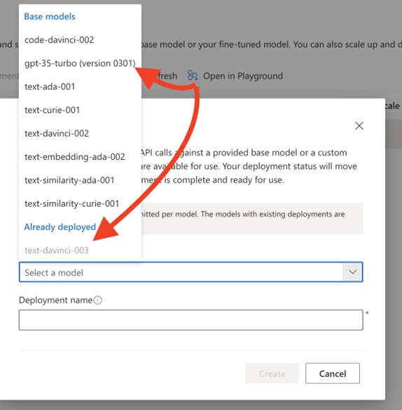

You can also deploy code-davinci-002 if you are going to ask more code questions, but asking and answering those via SMS might be hard to read. You could also use gpt-35-turbo for faster responses, but it will cost a bit more and I haven't seen latency as an issue with the text model.

Now that your model is deployed you can play with it in the GPT playground. Experiment with questions, lengths of responses, how much you want it to think, the amount of responses, how close it is, how much liberty it takes, etc. Here are some out of the box demo items to see examples in action.
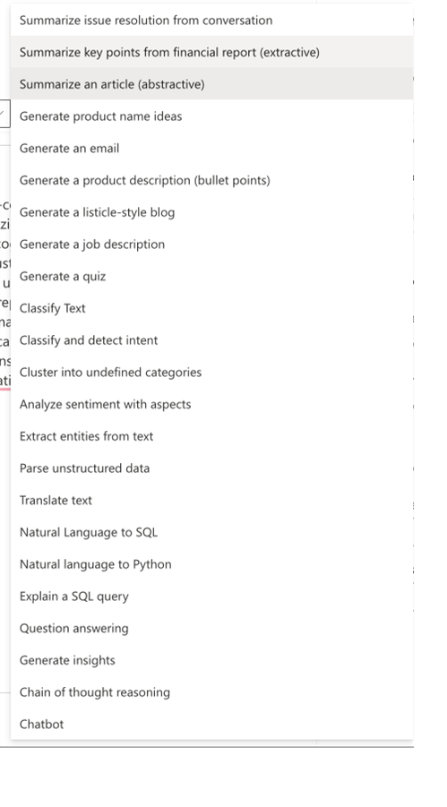

Now we want to view the code and the JSON by clicking the view code button and we can save it off later for our Logic App.
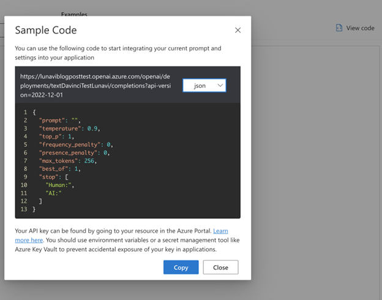

We also want to get the password for this, so exit the playground and go back to the service in the portal. You can find the key here. We will need it for later.
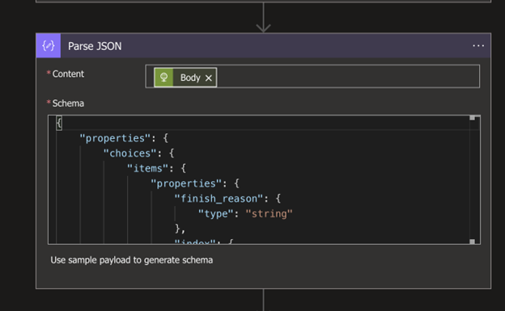

Now we want to create our logic app. Here is the high-level order of steps.
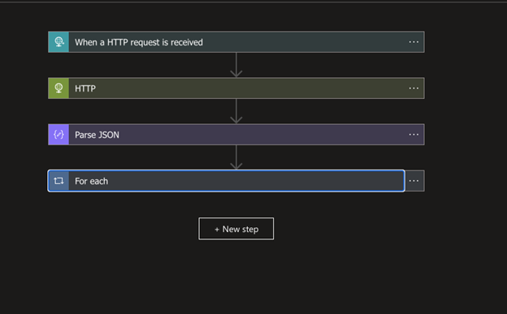

We want to start with “an HTTP request is received.” That will be our ingress to our logic app via Post. Once this URL is saved it will be used in Twilio so make sure to save it for later.
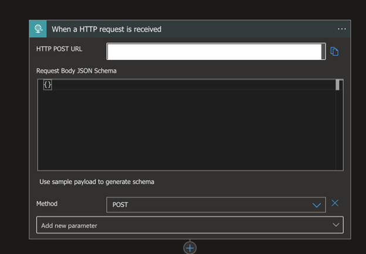

Now we want to send the text we get from Twilio to our AI service that will look like step two!
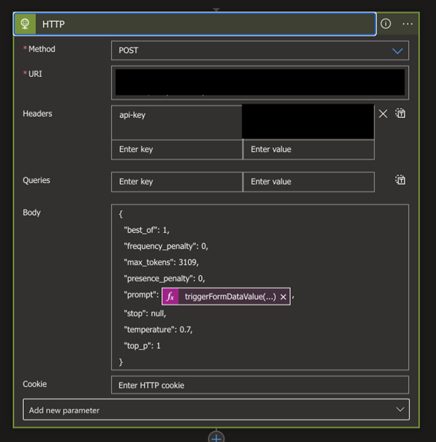

After this, we want to parse the JSON we getback from the AI service so we can evaluate it.

You can use the payload from the playground to map this JSON.
Finally, we want to have a “For Each” step:
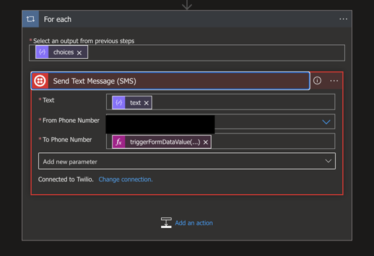

Inside of the “For Each” we are going to sign into Twilio and send the response back. This is because the AI model is technically a list, since you can have multiple responses (in this case we configured the app to use 1). “Text” is the text response, and the “to phone number” if the from phone number from the original HTTP ingress.

### TWILIO PART 2
Now, we need to configure where Twilio sends texts when we receive them.
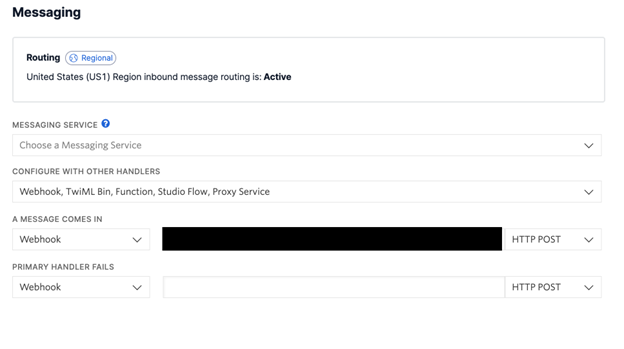

Now we are finally configured! Assuming things worked well we can fire a request and get a text back!
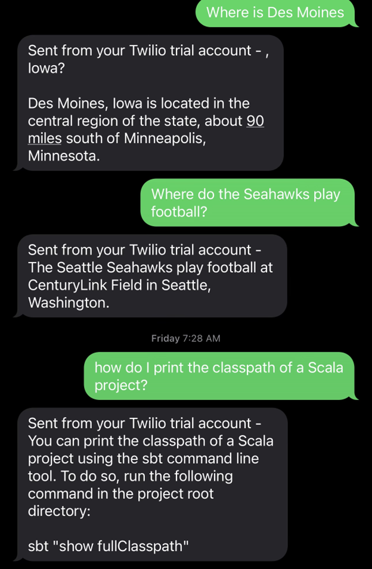

### Helpful Debugging
If you are having issues with your Logic App you can exit the Designer and see where your Run was failing. You can walk through errors in the Logic App that would look like this:
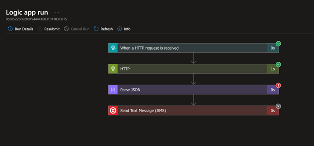

If you don't see any errors here, Twilio also has a Monitor section that looks like this:

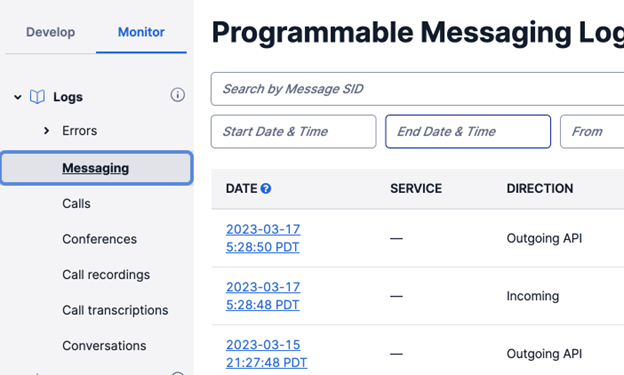

### Conclusion
Now, in just two hours, you are able to create an AI-powered search engine that in the late 2000s raised over $6 million in funding right out of the gate. Today this whole solution will cost you almost nothing!

This SMS answer service could be used for a number of use cases, namely customer service and support. It’s also a great way to practice implementing Azure Logic Apps and Azure AI Open AI Services within your Azure services.

‍
