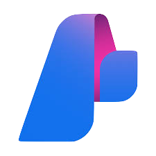

    <figure style="text-align: center;">
        
        <figcaption><b>Microsoft Copilot</b></figcaption>
    </figure>
    <figure style="text-align: center;">
        
        <figcaption><b>Azure Machine Learning</b></figcaption>
    </figure>
    <figure style="text-align: center;">
        
        <figcaption><b>Azure AI Studio</b></figcaption>
    </figure>

# What are my options?
There are currently 3 main workflows in Microsoft's ecosystem for AI. They are: Azure Open AI/Azure AI Studio (which just went GA), Azure Machine Learning, and Microsoft Copilot. Each of these has their own unique features and use cases, so let's dive into each one to help you decide which is right for you.

## How much do you like code?
If you do not enjoy coding or getting super far in the weeds of AI modeling/training there is only one main option for you to choose. That would be Microsoft Copilot Studio for building your own custom AI agents. This is a great option for those who want to get started with AI but don't have a lot of experience in the field. Copilot Studio provides a user-friendly interface that guides you through the process of creating, testing, and deploying your first Copilot.

Copilot studio can is a great all in one stop for more of a drag and drop experience. It allows you to pick the model you would like to use (for example GPT 3.5 Turbo or GPT 4.0). Next, it you are able to easily integrate it with your existing data sources (also know as R.A.G. or retrieval augmented generation). Recently announced you can now have actions to kick off jobs to call APIs or other services. Finally, there are some pre-built integrators so you can easily get this Copilot into your existing applications (like Teams, Slack, or even your own custom app).

## How much data or time do you have?
Next option would be how much time and data do you have? If you have a very specific use case, a lot of data, and a lot of time to train your model then Azure Machine Learning is the right choice for you. Azure Machine Learning is a cloud-based service that provides a comprehensive set of tools and services for building, training, and deploying machine learning models. It offers a wide range of algorithms and tools to help you build and train your models, as well as powerful data processing capabilities to help you prepare your data for training. 

Some drawbacks of this is you are going to be liable for the model you produce. By doing that you will need to make sure biases aren't there, that the model has enough data to be accurate, and that you are able to explain the model to others. You are also going to need to have some data scientists skills to build your own custom models from scratch. The time piece is there, because you will also need to pay to train your model and that can get expensive. 

This is a great option for those who have a lot of data and time to train their model, but it may not be the best choice for those who are looking for a quick and easy solution.

## What's left?
Azure Open AI and Azure Studio is left. Azure AI Studio was just put GA during Microsoft Build in 2024. This is a great option for those who want to get going, are a developer or comfortable with code, and want to get started with AI quickly. Azure AI Studio provides a user-friendly interface that guides you through the process of creating, testing, and deploying your first AI model. It offers a wide range of pre-built models and tools to help you get started, as well as powerful data processing capabilities to help you prepare your data for training. Azure Open AI Studio is a subset of features in Azure AI studio. Azure Open AI Studio is a great for developers to get going today! 

Specifically, Azure AI Studio is a great option for those who are looking for a quick and easy solution to get started with AI, as well as those who are looking for a more comprehensive set of tools and services to help them build their assistants. You can deploy Azure models as well as other open source models! It also has tools to help you with LLMops (if you want to know what that is no fear a next blog post is here! or soon).

If you are looking for a smaller subset of features, Azure Open AI Studio may be the right choice for you. I recommend when people are starting to start there. It has a lot of examples to get start using Azure Open AI models. The nice part about this is it only supports the consumption or serverless models. So you only pay for these as you go. They also allows you to generate images and build assistants to use in your applications! 